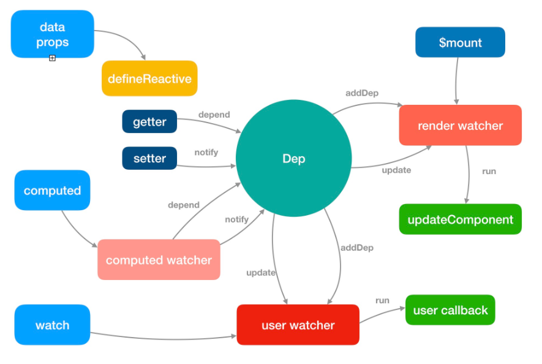

# Vue 响应式原理

首先试想一下以下代码中点击\$('#value')元素会发生什么呢？会触发 test 方法吗

```vue
<template>
  <div>
    <div id="value" @click="age += 's'">text: {{ value }}</div>
    <span> age: {{ age }} </span>
  </div>
</template>

<script>
export default {
  data() {
    return { name: '12', age: '12' };
  },
  computed: {
    value() {
      this.test();
      return this.name;
    },
  },
  methods: {
    test() {
      console.log('computed text again!');
      console.log(this.age);
    },
  },
};
</script>

```

答案是会触发。这是什么原因呢，为什么会触发 test 方法呢，是 computed 的依赖收集收集还会收集到 test 函数里面去？

如果你不是很清楚为什么会触发，可以先看以下的 watcher 解析，看完再回过来思考此处是如果收集依赖的。

答案解析：

介绍完了 vue 中的依赖收集和大致的派发更新原理后我们可以回过来思考开始的问题

为了解答这个问题，我们需要了解 computed 是何如何收集依赖的，为什么 computed 里面调用的函数里面涉及到的 data 也能够收集到？带着疑问我们看下 computed 是如果收集依赖的

在以下的从 vue3 种 watcher 响应式原理解析理解完成之后不难理解以上代码点击\$('#id')元素会发生了，由于 text 的 getter 函数中执行了 test 函数，此时访问了 age 属性，age 的 dep 会收集 text 的 ComputedWatcher，那么自然在 age 改变时就会触发 computed 重新计算。

watcher 解析

- 在 vue 中 Watcher 不仅是 dep 和页面渲染 render 的桥梁，computed 属性和 watch 属性也是 Watcher 构造函数在不同情况下的实现，以下从响应式的依赖收集和派发更新分别分析
- 解析 watcher 首先看下 Dep 是如何实现的，Dep 实现了对 watcher 的管理，是连接数据和 watcher 的桥梁

```javascript
export default class Dep {
  static target: ?Watcher;
  id: number;
  subs: Array<Watcher>;
  constructor () {
    this.id = uid++
    this.subs = []
  }
// 添加watcher
  addSub (sub: Watcher) {
    this.subs.push(sub)
  }
// 移除watcher
  removeSub (sub: Watcher) {
    remove(this.subs, sub)
  }
// 让watcher添加自己Dep
  depend () {
    if (Dep.target) {
      Dep.target.addDep(this)
    }
  }

// 通知watche触发更新
  notify () {
    const subs = this.subs.slice()
    if (process.env.NODE_ENV !== 'production' && !config.async) {
      subs.sort((a, b) => a.id - b.id)
    }
    for (let i = 0, l = subs.length; i < l; i++) {
      subs[i].update()
    }
  }
}
Dep.target = null
const targetStack = []
//targetStack 是为了保存watcher，当前一个的watcher改变的时候，前一个watcher还没有收集完，那么当当前watcher执行完成之后，可以回到前一个watcher
function pushTarget (target: ?Watcher) {
  targetStack.push(target)
  Dep.target = target
}
export function popTarget () {
  targetStack.pop()
  Dep.target = targetStack[targetStack.length - 1]
}
```

## 依赖收集

data 中的数据会循环并递归执行 defineReactive，使得每个 data 上的对象都是响应式的

```javascript
export function defineReactive (
  obj: Object,
  key: string,
  val: any,
  customSetter?: ?Function,
  shallow?: boolean
) {
// 每个对象都有一个Dep实例，以保存管理watcher列表以便在数据变化是让watcher更新，执行更新视图
  const dep = new Dep()
//...
  let childOb = !shallow && observe(val)
  Object.defineProperty(obj, key, {
    enumerable: true,
    configurable: true,
    get: function reactiveGetter () {
      const value = getter ? getter.call(obj) : val
      if (Dep.target) {
        dep.depend()
        if (childOb) {
          childOb.dep.depend()
          if (Array.isArray(value)) {
            dependArray(value)
          }
        }
      }
      return value
    },
    set: function reactiveSetter (newVal) {
      const value = getter ? getter.call(obj) : val
    //...
      if (setter) {
        setter.call(obj, newVal)
      } else {
        val = newVal
      }
     // 此处重新让新赋值对象的变成响应式
      childOb = !shallow && observe(newVal)
      dep.notify()
    }
  })
}
```

数据对象的访问会触发 getter 方法，那么什么时候会被访问呢，在 vue 组件的 mountComponent 方法执行时会需要渲染并访问到数据，从而触发 getter，以下是关键代码

```javascript
updateComponent = () => {
  vm._update(vm._render(), hydrating)
}
new Watcher(vm, updateComponent, noop, {
  before () {
    if (vm._isMounted) {
      callHook(vm, 'beforeUpdate')
    }
  }
}, true /* isRenderWatcher */)
```

## render watcher（watcher 通知页面渲染）

- 以上实例化了一个 renderWatcher
  - 首先进入 watcher 的构造函数
  - 到 `<span class="ne-text">this.value = this.lazy ? undefined : this.get()</span>` 执行 this.get() 方法
  - 进入 get 函数，首先会执行：pushTarget(this)，把 Dep.target 赋值为当前的 renderWatcher 并压栈（为了恢复用)
  - 接着执行了：`<span class="ne-text">value = this.getter.call(vm, vm)</span>`this.getter 对应就是 updateComponent 函数，这实际上就是在执行：`<span class="ne-text">vm._update(vm._render(), hydrating)</span>`,它会先执行 vm.\_render() 方法，因为之前分析过这个方法会生成 渲染 VNode，并且在这个过程中会对 vm 上的数据访问，这个时候就触发了 data 数据对象的 getter。
  - 然后将每个 data 对象的 dep 都加入这个 renderWatcher，在数据更新的时候即 setter 中调用 renderWatcher 的 update 方法，重新渲染

```javascript
export default class Watcher {
  constructor (
    vm: Component,
    expOrFn: string | Function,
    cb: Function,
    options?: ?Object,
    isRenderWatcher?: boolean
  ) {
    this.vm = vm
    // 1.如果是renderWatcher，记录当前的watcher
    if (isRenderWatcher) {
      vm._watcher = this
    }
    // 全局watchers记录
    vm._watchers.push(this)
    // options
    if (options) {
      this.deep = !!options.deep
      this.user = !!options.user
      this.lazy = !!options.lazy
      this.sync = !!options.sync
      this.before = options.before
    } else {
    // 从此处可以看到watcher有4中类型分别是deep、user、lazy、sync类
      this.deep = this.user = this.lazy = this.sync = false
    }
    this.cb = cb
    this.id = ++uid // uid for batching
    this.active = true
    this.dirty = this.lazy // for lazy watchers
    this.deps = []
    this.newDeps = []
    this.depIds = new Set()
    this.newDepIds = new Set()
    this.expression = process.env.NODE_ENV !== 'production'
      ? expOrFn.toString()
      : ''
    // parse expression for getter
    if (typeof expOrFn === 'function') {
      this.getter = expOrFn
    } else {
    // watch 转换'a.b.c'为this.a.b.c,转换路径
      this.getter = parsePath(expOrFn)
    }
    // 这里调用了get方法，如果lazy为true代表是computed属性，此处先忽略。
    this.value = this.lazy
      ? undefined
      : this.get()
  }
  get () {
  // 把 Dep.target 赋值为当前的渲染 watcher 并压栈（为了恢复用）
    pushTarget(this)
    let value
    const vm = this.vm
    try {
    // 调用updateComponent方法，在此处组件渲染
      value = this.getter.call(vm, vm)
    } catch (e) {
      if (this.user) {
        handleError(e, vm, `getter for watcher "${this.expression}"`)
      } else {
        throw e
      }
    } finally {
      // "touch" every property so they are all tracked as
      // dependencies for deep watching
      if (this.deep) {
        traverse(value)
      }
      popTarget()
      this.cleanupDeps()
    }
    return value
  }
  addDep (dep: Dep) {
    const id = dep.id
    if (!this.newDepIds.has(id)) {
      this.newDepIds.add(id)
      this.newDeps.push(dep)
      if (!this.depIds.has(id)) {
        // 主要是走这里添加依赖
        dep.addSub(this)
      }
    }
  }
  update () {
    /* istanbul ignore else */
    if (this.lazy) {
      this.dirty = true
    } else if (this.sync) {
      this.run()
    } else {
      queueWatcher(this)
    }
  }
  run () {
    if (this.active) {
      const value = this.get()
      if (
        value !== this.value ||
        // Deep watchers and watchers on Object/Arrays should fire even
        // when the value is the same, because the value may
        // have mutated.
        isObject(value) ||
        this.deep
      ) {
        // set new value
        const oldValue = this.value
        this.value = value
        if (this.user) {
          try {
            this.cb.call(this.vm, value, oldValue)
          } catch (e) {
            handleError(e, this.vm, `callback for watcher "${this.expression}"`)
          }
        } else {
          this.cb.call(this.vm, value, oldValue)
        }
      }
    }
  }
  evaluate () {
    this.value = this.get()
    this.dirty = false
  }

  depend () {
    let i = this.deps.length
    while (i--) {
      this.deps[i].depend()
    }
  }
}
```

## computed watcher （computed 属性实现）

- 首先找到 initComputed 函数

```plain
const computedWatcherOptions = { computed: true }
function initComputed (vm: Component, computed: Object) {
  const watchers = vm._computedWatchers = Object.create(null)
  // computed properties are just getters during SSR
  const isSSR = isServerRendering()

  for (const key in computed) {
    const userDef = computed[key]
    const getter = typeof userDef === 'function' ? userDef : userDef.get

    if (!isSSR) {
      //为每个computed属性创建一个computed watcher，该watcher的options是lazy属性为true
      watchers[key] = new Watcher(
        vm,
        getter || noop,
        noop,
        computedWatcherOptions
      )
    }
    defineComputed(vm, key, userDef)
  }
}

---------------------------------------------------------
export function defineComputed (
  target: any,
  key: string,
  userDef: Object | Function
) {
  const shouldCache = !isServerRendering()
  // 处理是computed属性是包含setter的对象还是只有getter的函数，主要是处理createComputedGetter方法
  if (typeof userDef === 'function') {
    sharedPropertyDefinition.get = shouldCache
      ? createComputedGetter(key)
      : userDef
    sharedPropertyDefinition.set = noop
  } else {
    sharedPropertyDefinition.get = userDef.get
      ? shouldCache && userDef.cache !== false
        ? createComputedGetter(key)
        : userDef.get
      : noop
    sharedPropertyDefinition.set = userDef.set
      ? userDef.set
      : noop
  }
  Object.defineProperty(target, key, sharedPropertyDefinition)
}
---------------------------------------------------------
// 重点！
function createComputedGetter (key) {
  return function computedGetter () {
    const watcher = this._computedWatchers && this._computedWatchers[key]
    if (watcher) {
      watcher.depend()
      return watcher.evaluate()
    }
  }
}
```

- 以上 computed 的初始化逻辑结束，下面我们来梳理一下整个逻辑
- 首先为每个 computed 属性创建一个 computed watcher，该 watcher 的 options 是 lazy 属性为 true
- 在 watcher 的构造函数中判断如果是 computedwatcher 不会立刻求值，会给该 computedwatcher 创建一个 Dep 实例

```plain
constructor (
  vm: Component,
  expOrFn: string | Function,
  cb: Function,
  options?: ?Object,
  isRenderWatcher?: boolean
) {
  // ...
  if (this.computed) {
    this.value = undefined
    this.dep = new Dep()
  } else {
    this.value = this.get()
  }
}
```

- 然后当 mount 的时候 render 函数执行到该 computed 属性，会触发该计算属性的 getter，会执行 createComputedGetter 函数，然后会执行 watcher.depend()，
- 主要是执行了 `<span class="ne-text">watcher.depend</span>`方法，这个时候的 Dep.target 是 render watcher，执行该方法会使得 render watcher 订阅这个 computed watcher 的变化。

```plain
// 让当前正在收集依赖的watcher添加自己
Watcher.depend () {
    let i = this.deps.length
// 如果是renderWatcher，this.deps是每个data的dep
// 如果是computedWatcher，this.deps是getter里面访问到的data的dep
    while (i--) {
      this.deps[i].depend()
    }
}
// 让当前正在收集依赖的watcher添加自己
Dep.depend () {
    if (Dep.target) {
      Dep.target.addDep(this)
    }
}
Watcher.addDep (dep: Dep) {
    const id = dep.id
    if (!this.newDepIds.has(id)) {
      this.newDepIds.add(id)
      this.newDeps.push(dep)
      if (!this.depIds.has(id)) {
        dep.addSub(this)
      }
    }
  }
```

- 然后执行 `<span class="ne-text">watcher.evaluate</span>`方法
- evaluate 的逻辑非常简单，判断 this.dirty，如果为 true 则通过 this.get() 求值，然后把 this.dirty 设置为 false。在求值过程中，会执行 value = this.getter.call(vm, vm)，这实际上就是执行了计算属性定义的 getter 函数

```plain
evaluate () {
  if (this.dirty) {
    this.value = this.get()
    this.dirty = false
  }
  return this.value
}
get () {
// 此处将Dep.target赋值为该computedwatcher,targetStack中有renderWatcher和该computedWatcher
    pushTarget(this)
    let value
    const vm = this.vm
    try {
    // 在此处执行computedgetter函数，为computedWatcher收集依赖，给每个computed getter函数中访问到的data的dep添加该computedWatcher
      value = this.getter.call(vm, vm)
    } catch (e) {
      if (this.user) {
        handleError(e, vm, `getter for watcher "${this.expression}"`)
      } else {
        throw e
      }
    } finally {
      // "touch" every property so they are all tracked as
      // dependencies for deep watching
      if (this.deep) {
        traverse(value)
      }
      // 移除该computedwatcher的将Dep.target指向栈中的renderwatcher，因为此时还处于render函数执行过程中
      popTarget()
      this.cleanupDeps()
    }
    return value
  }
```

computed 是如何实现的缓存的？

- 缓存是相对方法而言的，当页面重新渲染，一定会调用方法重新计算，而 computed 属性由于有缓存即 lazy 标志是否需要重新计算 flag 实现缓存不需要重新渲染都重新计算
- 只有 dirty 为 true 时才会进行重新计算，否则直接获取已经计算好的值
- 计算属性在创建 Watcher 依赖时，会传递一个 lazy 为 true 的属性。将 lazy 直接赋予到 Watcher 的 dirty 属性中（至于 dirty ，可以理解为是否为脏数据）。因此一开始，计算属性在页面中都会被计算一遍。另一方面，由于会把计算属性的 Getter 函数传入到 Wacther 作为更新回调函数使用，一旦依赖的响应式属性变化时，就会调用更新回调函数进行重新计算计算属性的值。
- 当页面第一次引用了计算属性时，dirty 的值肯定会为 true ，就会调用 Watcher 的 evaluate 方法。接下来，我们来看看 evaluate 方法在调用 get 计算最新值后，设置 this.dirty = false，表示 computed 值刚计算完肯定是最新的
- 那么什么时候 dirty 会设回 true？
- 计算属性的 Watcher 只会被收集到相对应的响应式属性中，因此在 computed 依赖的响应式属性更改后，通知到相对应的 Watcher 进行更新，其实就会在 update 函数中进行设置 dirty 为 true，我们来看看

```plain

//只有 dirty 为 true 时才会进行重新计算，否则直接获取已经计算好的值
evaluate () {
  if (this.dirty) {
    this.value = this.get()
    this.dirty = false
  }
  return this.value
}
// 计算属性的 Watcher 只会被收集到相对应的响应式属性中，因此在响应式属性更改后，通知到相对应的 Watcher 进行更新，其实就会在 update 函数中进行设置 dirty 为 false，
Watcher.prototype.update = function update () {
// computedWatcher的lazy才为true
  if (this.lazy) {
    this.dirty = true;
  }
  // ...
};
```

## user watcher（watch 属性实现）

```plain

function initWatch (vm, watch) {  // 初始化方法
  for (const key in watch) {  // 遍历watch内多个监听属性
    const handler = watch[key]  // 每一个监听属性的值
    if (Array.isArray(handler)) {  // 如果该项的值为数组
      for (let i = 0; i < handler.length; i++) {
        createWatcher(vm, key, handler[i])  // 将每一项使用watcher包装
      }
    } else {
      createWatcher(vm, key, handler) // 不是数组直接使用watcher
    }
  }
}

---------------------------------------------------------

function createWatcher (vm, expOrFn, handler, options) {
  if (isPlainObject(handler)) { // 如果是对象，参数移位
    options = handler
    handler = handler.handler
  }
  if (typeof handler === 'string') {  // 如果是字符串，表示为方法名
    handler = vm[handler]  // 获取methods内的方法
  }
  return vm.$watch(expOrFn, handler, options)  // 封装
}
// 以上对监听属性的多种不同的使用方式，都做了处理。使用示例在官网上均可找到：watch示例。可以看到最后是调用了vm.$watch方法。

---------------------------------------------------------
Vue.prototype.$watch = function(expOrFn, cb, options = {}) {
  const vm = this
  if (isPlainObject(cb)) {  // 如果cb是对象，当手动创建监听属性时
    return createWatcher(vm, expOrFn, cb, options)
  }
  options.user = true  // user-watcher的标志位，传入Watcher类中
  const watcher = new Watcher(vm, expOrFn, cb, options)  // 实例化user-watcher
  if (options.immediate) {  // 立即执行
cb.call(vm, watcher.value)  // 以当前值立即执行一次回调函数
  }  // watcher.value为实例化后返回的值
  return function unwatchFn () {  // 返回一个函数，执行取消监听
    watcher.teardown()
  }
}
```

- 由上可以知道，watcher 最后还是通过 new watcher 实现的，options 是 user = true，普通 watcher 即通过 user watcher 实现

```plain
class Watcher {
  constructor(vm, expOrFn, cb, options) {
    this.vm = vm
    vm._watchers.push(this)  // 添加到当前实例的watchers内
    if(options) {
      this.deep = !!options.deep  // 是否深度监听
      this.user = !!options.user  // 是否是user-wathcer
      this.sync = !!options.sync  // 是否同步更新
    }
this.active = true  // // 派发更新的标志位
    this.cb = cb  // 回调函数
    if (typeof expOrFn === 'function') {  // 如果expOrFn是函数
      this.getter = expOrFn
    } else {
      this.getter = parsePath(expOrFn)  // 如果是字符串对象路径形式，返回闭包函数
    }
    ...
  }
}
----------------------------------------------------------
const bailRE = /[^\w.$]/  // 得是对象路径形式，如info.name

function parsePath (path) {
  if (bailRE.test(path)) return // 不匹配对象路径形式，再见
  const segments = path.split('.')  // 按照点分割为数组
  return function (obj) {  // 闭包返回一个函数
    for (let i = 0; i < segments.length; i++) {
      if (!obj) return
      obj = obj[segments[i]]  // 依次读取到实例下对象末端的值，所以会逐层收集依赖
    }
    return obj
  }
}
```

- parsePath 方法最终返回一个闭包方法，此时 Watcher 类中的 this.getter 就是一个函数了，再执行 this.get()方法时会将 this.vm 传入到闭包内，补全 Watcher 其他的逻辑：

```plain
class Watcher {c
  constructor(vm, expOrFn, cb, options) {
    ...
    this.getter = parsePath(expOrFn)  // 返回的方法
    this.value = this.get()  // 执行get
  }
  get() {
    pushTarget(this)  // 将当前user-watcher实例赋值给Dep.target，读取时收集它
    let value = this.getter.call(this.vm, this.vm)  // 将vm实例传给闭包，进行读取操作
    if (this.deep) {  // 如果有定义deep属性
      traverse(value)  // 进行深度监听
    }
    popTarget()
    return value  // 返回闭包读取到的值，参数immediate使用的就是这里的值
  }
  ...
}
```

## 派发更新

- 以上 3 中数据无论是 renderwatcher 收集的 data 对象属性变化，还是 computed 收集的依赖属性变化还是 watch 的单个属性变化，都会调用变化的属性或值的 dep 的 watcher 数组执行 updata 方法

```plain
update () {
    /* istanbul ignore else */
    if (this.lazy) {
      this.dirty = true // 此处执行了update方法，讲dirty置为true，表示下次需要更新
    } else if (this.sync) {
    // sync为true表示立即执行
      this.run()
    } else {
    // 普通的更新的任务都放在队列当中，异步更新
      queueWatcher(this)
    }
  }
-----------------------------------------
run () {
    if (this.active) {
    // 获取最新值
      const value = this.get()
      if (
        value !== this.value ||
        isObject(value) ||
        this.deep
      ) {
        const oldValue = this.value
        this.value = value
        if (this.user) {
        // 普通watcher将新旧值传递给cb
          try {
            this.cb.call(this.vm, value, oldValue)
          } catch (e) {
            handleError(e, this.vm, `callback for watcher "${this.expression}"`)
          }
        } else {
          this.cb.call(this.vm, value, oldValue)
        }
      }
    }
  }
-----------------------------------------
const queue: Array<Watcher> = []
let has: { [key: number]: ?true } = {}
let waiting = false
let flushing = false
 /*将一个观察者对象push进观察者队列，在队列中已经存在相同的id则该观察者对象将被跳过，除非它是在队列被刷新时推送*/
查看queueWatcher的源码我们发现，Watch对象并不是立即更新视图，而是被push进了一个队列queue，此时状态处于waiting的状态，这时候会继续会有Watch对象被push进这个队列queue，等到下一个tick运行时，这些Watch对象才会被遍历取出，更新视图。同时，id重复的Watcher不会被多次加入到queue中去，因为在最终渲染时，我们只需要关心数据的最终结果。
export function queueWatcher (watcher: Watcher) {
  const id = watcher.id
  if (has[id] == null) {
    has[id] = true
    if (!flushing) {
      queue.push(watcher)
    } else {
      let i = queue.length - 1
      while (i > index && queue[i].id > watcher.id) {
        i--
      }
      queue.splice(i + 1, 0, watcher)
    }
    // queue the flush
    if (!waiting) {
      waiting = true
// 此处调用nextTick方法包装队列异步执行
      nextTick(flushSchedulerQueue)
    }
  }
}
```

## 队列排序

queue.sort((a, b) => a.id - b.id) 对队列做了从小到大的排序，这么做主要有以下要确保以下几点：

组件的更新由父到子；因为父组件的创建过程是先于子的，所以 watcher 的创建也是先父后子，执行顺序也应该保持先父后子。
用户的自定义 watcher 要优先于渲染 watcher 执行；因为用户自定义 watcher 是在渲染 watcher 之前创建的。
如果一个组件在父组件的 watcher 执行期间被销毁，那么它对应的 watcher 执行都可以被跳过，所以父组件的 watcher 应该先执行。

## nextTick

在 Vue 中，可以通过 this.\$nextTick 方法来确保在 DOM 更新完成后执行回调函数和获取更新后的 DOM。例如，如果你在数据变化后立即尝试获取 DOM 元素的内容，可能会发现获取的还是旧的内容。而在 nextTick 方法内部获取的将是更新后的内容

### 异步更新 DOM 的原因

异步更新 DOM 是为了优化性能和提升用户体验。在 Vue 中，数据变化触发更新后，并不会立即反映在 DOM 上，而是将更新操作添加到一个异步队列中。这样做有几个好处：

1. 性能优化 ：通过将多次数据变化合并到一个批处理中，减少了不必要的 DOM 操作，提高了性能。如果每次数据变化都立即触发 DOM 更新，可能会导致频繁的重绘和回流，影响页面的流畅性和性能。
2. 减少重复更新 ：如果在同一个事件循环中发生多次数据变化，Vue 会将它们合并为一个更新，避免多次无谓的 DOM 更新。
3. 防止过度渲染 ：在某些情况下，组件的数据可能会在同一事件循环中发生多次变化。如果每次变化都立即触发 DOM 更新，可能会导致不必要的重复渲染。
4. 提升用户体验 ：异步更新可以确保 Vue 在适当的时机执行 DOM 更新，从而减少阻塞主线程的情况，保证用户界面的响应性。

### 如何使用异步更新 DOM

确保函数执行过程中对数据任意的修改，触发变化执行 nextTick 的时候强制走 microTimerFunc。比如对于一些 DOM 交互事件，如 v-on 绑定的事件回调函数的处理，会强制走 macrotask。

- Vue 的 nextTick 之所以优先使用微任务实现?

  - 主要是因为微任务相比宏任务在执行效率上更高。在 JavaScript 的事件循环中，微任务（例如 Promise 的.then 和 MutationObserver）会在当前执行栈清空后进行，而不会等待其他宏任务（例如 setTimeout、setInterval）的执行。这意味着微任务可以更早地被执行，从而减少了等待时间，提高了应用的响应速度。
    - event loop

      - 执行一个宏任务
      - 清空所有微任务
      - 由浏览器判断是否需要 ui render
    - 由于 vue 的更新是异步的，我们要获取更新后的 dom，其实是只要保证回调函数在更新后尽快执行就可以了

      - 根据浏览器的渲染机制，渲染线程是在微任务执行完成之后运行的。渲染线程没运行，怎么拿到 Dom 呢？
      - 因为，渲染线程只是把 Dom 树渲染成 UI 而已，Vue 更新 Dom 之后，在 Dom 树里，新的 Dom 节点已经存在了，js 线程就已经可以拿到新的 Dom 了。除非开发者读取 Dom 的计算属性，触发了强制重流渲染线程才会打断 js 线程。
- 在 Vue 的实现中，它会优先检测当前浏览器是否支持原生 Promise，如果支持，则使用 Promise 的.then 方法来实现 nextTick。如果不支持 Promise，则会检测是否支持 MutationObserver，如果支持，则使用 MutationObserver。如果上述两种都不支持，才会退回到使用 setTimeout 来实现nextTick。

```plain
/*
    延迟一个任务使其异步执行，在下一个tick时执行，一个立即执行函数，返回一个function
    这个函数的作用是在task或者microtask中推入一个timerFunc，在当前调用栈执行完以后以此执行直到执行到timerFunc
    目的是延迟到当前调用栈执行完以后执行
*/

//传入的cb会被push进callbacks中存放起来，然后执行timerFunc（pending是一个状态标记，保证timerFunc在下一个tick之前只执行一次）。
// 使用Promise、MutationObserver、setTimeout以及setImmediate、MessageChannel等尝试得到timerFunc的方法。

export function nextTick (cb?: Function, ctx?: Object) {
  let _resolve
  callbacks.push(() => {
    if (cb) {
      try {
        cb.call(ctx)
      } catch (e) {
        handleError(e, ctx, 'nextTick')
      }
    } else if (_resolve) {
      _resolve(ctx)
    }
  })
  if (!pending) {
    pending = true
// 此方法把回调包装在异步任务队列中执行
    timerFunc()
  }
  // $flow-disable-line
  if (!cb && typeof Promise !== 'undefined') {
    return new Promise(resolve => {
      _resolve = resolve
    })
  }
}
```

- timerFunc 的实现比较简单，执行的目的是在 microtask 或者 task 中推入一个 function，在当前栈执行完毕（也许还会有一些排在前面的需要执行的任务）以后执行 nextTick 传入的 function
  JS 的 event loop 执行时会区分 task 和 microtask，会执行一个宏任务再执行完所有的微任务，所以微任务的优先级总比宏任务高，所以此处用微任务模拟执行回调
- \$nextTick 也是内部用了 nextTick 方法，用微任务模拟执行回调

```plain
Vue.prototype.$nextTick = function (fn: Function) {
  return nextTick(fn, this)
}
```

注意： dom 更新和 next 函数的调用都是通过 nextTick 执行，都是在同一次微任务队列中清空执行，所以修改的先后顺序是重要的，如果在更新 data 之前调用 nextTick 则拿不到更新后的 dom

## 原理图

最后缕一下整个流程：原理图如下



[learnVue/docs/Vue.js 异步更新 DOM 策略及 nextTick.MarkDown at master · answershuto/learnVue](https://github.com/answershuto/learnVue/blob/master/docs/Vue.js%E5%BC%82%E6%AD%A5%E6%9B%B4%E6%96%B0DOM%E7%AD%96%E7%95%A5%E5%8F%8AnextTick.MarkDown)

## 总结

vue 中 computed、data、watch 属性以及组件级别的 render 更新都是利用了自有的 Vue 中 Watcher 构造函数实现的功能，只是根据各自不同的特性修改了 watcher 的功能。利用 object.defineProperty 以及发布订阅模式实现属性的依赖收集和触发更新

- 一个组件有一个 watcher，用于在监听属性变化后重新渲染。在 Render 的时候做依赖收集
- data 也是每个属性都有一个 watcher，在初始化时遍历属性初始化 watcher
- watch 的依赖的固定的
- computed 会在初次计算时做依赖收集，在更新时判断是否有变化，没有变化不更新
- 触发 setter 后则执行对应的 watcher 的回调函数执行更新操作

触发更新后，vue 采用异步更新以及根据虚拟 dom 都 diff 算出差异更新，提高更新的效率。

## vue 最小功能实现

```
<!DOCTYPE html>
<html>
  <head>
    <meta charset="UTF-8" />
    <title></title>
  </head>

  <body>
    <div id="app"><input type="text" v-model="text" /> {{text}}</div>
  </body>

  <script type="text/javascript">
    function compile(node, vm) {
      var reg = /\{\{(.*)\}\}/; // 来匹配{{xxx}}中的xxx
      //如果是元素节点
      if (node.nodeType === 1) {
        var attr = node.attributes;
        //解析元素节点的所有属性
        for (let i = 0; i < attr.length; i++) {
          if (attr[i].nodeName == 'v-model') {
            var name = attr[i].nodeValue; //看看是与哪一个数据相关
            node.addEventListener('input', function (e) {
              //将与其相关的数据改为最新值
              vm[name] = e.target.value;
            });
            node.value = vm.data[name]; //将data中的值赋予给该node
            node.removeAttribute('v-model');
          }
        }
      }

      //如果是文本节点
      if (node.nodeType === 3) {
        if (reg.test(node.nodeValue)) {
          var name = RegExp.$1; //获取到匹配的字符串
          name = name.trim();
          //					node.nodeValue = vm[name]; //将data中的值赋予给该node
          new Watcher(vm, node, name); //绑定一个订阅者
        }
      }
    }

    //			在向碎片化文档中添加节点时，每个节点都处理一下
    function nodeToFragment(node, vm) {
      var fragment = document.createDocumentFragment();
      var child;
      while ((child = node.firstChild)) {
        compile(child, vm);
        fragment.appendChild(child);
      }
      return fragment;
    }
    //			Vue构造函数
    //		观察data中的所有属性值，注意增添了observe

    function Vue(options) {
      this.data = options.data;
      observe(this.data, this);
      var id = options.el;
      var dom = nodeToFragment(document.getElementById(id), this);
      //处理完所有节点后，重新把内容添加回去
      document.getElementById(id).appendChild(dom);
    }

    //		实现一个响应式监听属性的函数。一旦有赋新值就发生变化
    function defineReactive(obj, key, val) {
      var dep = new Dep();
      Object.defineProperty(obj, key, {
        get: function () {
          if (Dep.target) {
            dep.addSub(Dep.target);
          }
          return val;
        },
        set: function (newVal) {
          if (newVal === val) {
            return;
          }
          val = newVal;
          console.log('新值' + val);
          //一旦更新立马通知
          dep.notify();
        },
      });
    }

    //		实现一个观察者，对于一个实例 每一个属性值都进行观察。
    function observe(obj, vm) {
      for (let key of Object.keys(obj)) {
        defineReactive(vm, key, obj[key]);
      }
    }
    function observe(data) {
      for (var key in data) {
        // 每个data数据有一个dep，数据变化时，让dep通知所有观察者做出视图更新
        // 在编译时，会获取数据以将视图节点对应watcher（每个watcher需要有不用的更新视图的更新函数，所以一个视图节点对应一个watcher）
        // 将watcher添加到对应数据的dep当中
        if (data.hasOwnProperty(key)) {
          const dep = new Dep();
          Object.defineProperty(data, key, {
            //  enumerable:
            enumerable: true,
            configurable: true,
            get(val) {
              Dep.target && Dep.addSub(Dep.target);
              return val;
            },
            set(val) {
              Dep.notify();
              data[key] = val;
            },
          });
        }
      }
    }
    //		Watcher监听者
    // 因为一个data数据可能有不同的视图节点依赖，所以需要采用发布订阅模式来监听data数据变化更新相关视图节点的变化
    // 在编译时new watcher的时候将当前节点所对应watcher加入订阅器来监听对应data的相关视图变化
    function Watcher(vm, node, name) {
      Dep.target = this;

      this.vm = vm;
      this.node = node;
      this.name = name;

      this.update();

      Dep.target = null;
    }

    Watcher.prototype = {
      update() {
        this.get(); // 通过get将watcher加入订阅器
        this.node.nodeValue = this.value; //更改节点内容的关键
      },
      get() {
        this.value = this.vm[this.name]; //触发相应的get
      },
    };

    //		dep构造函数
    function Dep() {
      this.subs = [];
    }
    Dep.prototype = {
      addSub(sub) {
        this.subs.push(sub);
      },
      notify() {
        this.subs.forEach(function (sub) {
          sub.update();
        });
      },
    };
    var vm = new Vue({
      el: 'app',

      data: {
        text: '赵刚',
      },
    });
  </script>
</html>

```
