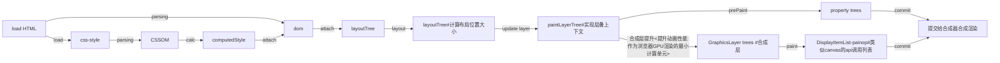
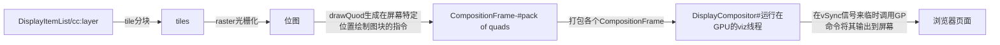
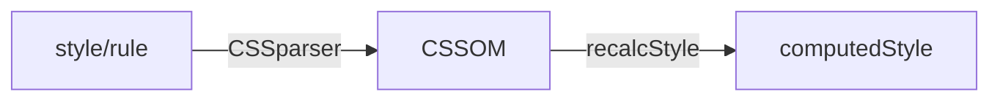

# A life of a pixel

## 渲染流水线

- 首先，在输入框输入 `www.mysite.com` 然后输入 `Enter` 由**浏览器进程的 UI thread** 来负责处理，通过 IPC 通知网络进程发送请求
- ui线程预先**准备一个渲染线程**
- 浏览器会将获取的响应数据交给**渲染进程**（renderer process），然后执行 以下操作渲染出页面


## 总结

在主线程、利用Blink内核的操作



在合成器线程操作，也就是合成操作



- Parse/DOM：将Content解析成DOM树，它是后面各个渲染流程的基础。
- Style：解析并应用样式表。
- Layout：布局。
- Update Layer：将整个页面按照一定规则，分成独立的图层，便于隔离更新。
- prepaint：构建属性树，使得可以单独操作某个节点（变换、裁剪、特效、滚动），不至于影响它的子节点。
- paint：Paint操作会将布局树（Layout Tree）中的节点（Layout Object）转换成绘制指令（例如绘制矩形、绘制字体、绘制颜色，这有点像绘制API的调用）的过程。然后把这些操作封装在Dsipaly Item中。
- Commit：commit会把paint阶段的数据拷贝给合成器线程。并且阻塞主线程
- Tiling：raster接收到paint阶段的绘制指令之后，会先对图层进行分块。图块是栅格化（Raster）的基本工作单位。
  - 可以想象网页特别长，我们不需要看到最下面的信息，如果都要渲染的话会花费很长的时间，所以我们将图层分层使用GPU  raster异步栅格化
- Raster：栅格化（将绘制操作变为像素位图（内存中））。
  - 可以使用GPU加速栅格化
    - 调用操作系统底层GPU是不安全的，所以需要将渲染过程与GPU过程分开（也即异步栅格化）
  - raster的功能包括
    - 抗锯齿功能
    - 文字LCD抗锯齿
  - 使用Skia库实现（也被安卓、firfox等使用）
    - 最终将paintOp转换为OpenGL或者Vulkan调用
- Draw：图块被栅格化以后，**合成器线程会为每个图块生成draw quads**（quads有四边形之意，它代表了在屏幕特定位置绘制图块的指令，包含属性树里面的变换、特效等信息），这些draw quads被封装到**Compositor Frame中输出给GPU**，Draw操作就是生成draw quads的过程。
- Display：生成了Compositor Frame以后，Viz会调用GL指令把draw quads最终输出到屏幕上。

## Parse HTML


Dom:包含两部分

- chrome的内部表示
- 暴露给JS的API：var div = document.body.firstChild；

## Recalc Style



### 解析CSSOM

1. 解析CSS，处理选择器与声明。[CSSParser](https://cs.chromium.org/chromium/src/third_party/blink/renderer/core/css/parser/css_parser.h?q=CSSParser&dr=CSs)
2. 生成样式表内容，包含多种样式规则。StyleSheetContents&StyleRule
   - 不同的样式规则均设置了方便查找的索引或类名。比如 [CSSSelectorList](https://cs.chromium.org/chromium/src/third_party/blink/renderer/core/css/css_selector_list.h?q=CSSSelectorList&dr=CSs) & [CSSPropertyValueSet](https://cs.chromium.org/chromium/src/third_party/blink/renderer/core/css/css_property_value_set.h?q=CSSPropertyValueSet&dr=CSs)
   - CSS属性类由一些py脚本在构建时自动生成。[make_css_property_subclasses.py](https://cs.chromium.org/chromium/src/third_party/blink/renderer/build/scripts/core/css/properties/make_css_property_subclasses.py?dr&g=0)

### CSS 对象模型（CSSOM）

在W3C标准中，它包含两个部分

- 描述样式表和规则等CSS的模型部分（CSSOM）
- 跟元素视图相关的View部分（CSSOM View）
- [CSS-API(CSS编程接口),CSSOM(css对象模型)](https://blog.csdn.net/u014711690/article/details/82346584)
- [CSSOM](https://wangdoc.com/javascript/dom/css.html)

### 生成computedStyle

1. 浏览器 CSS 匹配核心算法的规则是以 `从右向左`方式匹配节点的。这样做是为了减少无效匹配次数，从而匹配快、性能更优。
2. Style将document中解析后的样式规则(StyleSheetContents)与由浏览器提供的默认样式结合，重新计算。 [Document::UpdateStyle](https://cs.chromium.org/chromium/src/third_party/blink/renderer/core/dom/document.h?type=cs&q=Document::UpdateStyle&g=0&l=1705) & [StyleResolver::StyleForElement](https://cs.chromium.org/chromium/src/third_party/blink/renderer/core/css/resolver/style_resolver.h?type=cs&q=StyleResolver::StyleForElement&g=0&l=69)
3. 从 CSSStyleSheetList 中找出所有匹配相应元素的 property-value 对。匹配会通过CSSSelector 来验证，同时需要满足层叠规则。将所有的 declaration 中的 property 组织成一个大的数组。
4. 数组中的每一项纪录了这个 property 的selector，property 的值，权重（层叠规则）。(!important > 行内样式（权重1000） > ID 选择器（权重 100） > 类选择器（权重 10） > 标签（权重1） > 通配符 > 继承 > 浏览器默认属性)
5. 在为每个DOM元素计算最终的样式属性后，将结果保存在ComputedStyle中。

计算样式就是可能类似如下的表现：

```css
p > a { 
  color : red; 
  background-color:black;
}  
a {
  color : yellow
}  
div { 
  margin : 1px;
}
```

重新组织之后的数组数据为(weight我只是表示了他们之间的相对大小，并非实际值。）

```
   selector      property                       weight  
1, a             color:yellow                   1  
2, p > a         color:red                      2  
3, p > a         background-color:black         2  
4, div           margin:1px                     3
```

#### 共享 computedStyle

在特定情况下，浏览器会共享 computedStyle，网页中能共享的标签非常多，所以能极大的提升执行效率！如果能共享，那就不需要执行匹配算法了，执行效率自然非常高。

也就是说：如果两个或多个 element 的 computedStyle 不通过计算可以确认他们相等，那么这些 computedStyle 相等的 elements 只会计算一次样式，其余的仅仅共享该 computedStyle 。

那么有哪些规则会共享 computedStyle 呢？

- 元素不能有 `id`属性。
- 元素的标签名必须相同，即必须是同类型的元素。
- 元素的 `class`属性必须相同。
- 元素之间的 mappedAttribute（一些可以影响 CSS ComputedStyle 的 HTML 属性） 必须相等。
- 元素不能有 `style`属性，哪怕是这些元素的 `style`属性值相同也不可以。
- 不能使用 sibling selector。例如，`first-child`、`:last-selector`、`+ selector`。

  ```
  <span><p style="color:red">paragraph1</span></p>
  <span><p style="color:red">paragraph2</span></p>
  ```

#### [选择器书写建议](https://www.cnblogs.com/yangchin9/p/12516477.html)

- 使用例如BEM等标准CSS规范
- ID 选择器是非常高效的，且 ID 是唯一的，所以在使用的时候应该单独使用，不需要再指定标签名等。
- 避免深层次的选择器。
- 慎用子代选择器。
- 属性选择的的解析速度非常慢，慎用。

## Layout

#### 生成元素的定位与布局排版

##### 矩形区域

对于一个块级(block-level)元素，会计算它内容区域所占据的矩形坐标与尺寸。建立在盒模型的基础上
``

##### **流动方向**

最简单的情况下，所有块级元素按照DOM的顺序依次顺着竖直方向排列，称为 `block flow`。而text node和像 `<span>`这样的行内元素会生成inline box，一般情况下是在盒内由左向右的方向，不过RTL的语言，如阿拉伯语和希伯来语，它们的行内流动顺序是相反的。


##### **字体字形**

根据computed style中的font属性与文本，传入文本整形引擎HarfBuzz中来计算每个字形的尺寸和布局。字体整形时必须考虑其印刷特征：字距调整(kerning)与连写(ligatures)

##### **包围矩形**

对于一个简单元素可能会计算多种边界矩形，比如在出现overflow的情况下，会计算border box rect和layout overflow rect，若节点的overflow是可滚动的，则layout同样会计算滚动的边界并保留滚动条的空间。最常见的可滚动DOM节点就是document自身，即树的根节点。


##### **复杂布局**

某些元素可能具有较复杂的布局，比如table元素或由周围内容包围的浮动元素。注意DOM结构与ComputedStyle值是如何传给布局算法的：每个流水线阶段都会利用前一个阶段的结果。

- `<table>`
- float: left
- column-count: 3
- display: flex
- writing-mode: vertical-lr

#### 具体流程步骤

首先我们有DOM树，但是DOM树里面的DOM是供给JS/HTML/CSS用的，并不能直接拿过来在页面或者位图里绘制。因此浏览器内部实现了Layout object：

Layout Object上实现了将其对应的DOM节点绘制进位图的方法，负责绘制这个DOM节点的可见内容如背景、边框、文字内容等等。同时Render Object也是存放在一个树形结构中的。

##### 1.创建布局树

1. Layout在一颗与DOM相关联的另一颗树上(布局树)进行操作，布局树中的节点(LayoutObject),根据display属性使用了不同了布局算法（[NGLayoutAlgorithm](https://chromium.googlesource.com/chromium/src/+/master/third_party/blink/renderer/core/layout/ng/ng_layout_algorithm.h).），在layoutTree上同一棵tree上应用更新updateLayout
2. 每一个layout object都代表了一个矩形的区域，框的类型会受到与节点相关的“display”样式属性的影响

`Layout tree`也称为 `LayoutObject tree`，之前叫 `Render tree`；树中的每个节点称为 `LayoutObject`，之所以这么说是因为**布局树中所有节点所对应的类都继承自共同的布局基类**：`LayoutObject`。

在原来WebKit源码和比较老的文章描述中，这个类名叫 `RenderObject`; blink实现中改名为 `LayoutObject`，原因是blink把页面渲染划分成了 `Layout`，`Paint`，`Composite`多个阶段，以 `Pipeline`的形式体现生命周期; 相对来说，前者名称较笼统、关注全局，后者更形象、体现在某个阶段，理解起来更容易些。


##### 2.布局计算

1. dom和node不是一一对应的
   1. **匿名盒子**：inline 元素只能包含 block 元素或 inline 元素中的一种。如果包含多种，会自动创建一个匿名盒模型，这个盒模型也对应一个Anonymous RenderObject。
   2. **伪元素**：使用一个包含内容的伪元素（例如 `p::before { content: 'Hi!' }`）时，元素会出现在布局树中即使这个元素不存在于DOM树中
   3. **不生成layout object**：display：none的情况、`head`元素等
   4. **一个元素节点对应多个layout object**，一般针对复杂结构的元素，会创建多个呈现器，分别呈现。
      - “select”元素有 3 个呈现器：一个用于显示区域，一个用于下拉列表框，还有一个用于按钮。
      - 如果由于宽度不够，文本无法在一行中显示而分为多行，那么新的行也会作为新的呈现器而添加。
2. layout tree会跨越shadow root，是基于FlatTreeTraversal进行构建，该过程同样会对shadow DOM进行遍历。


```c++
class LayoutObject{
  virtual void layout(); //Render树建立之后，布局运算会计算出诸如位置，大小，是否浮动等样式布局信息。有了这些信息之后，渲染引擎才只知道在何处以及如何画这些元素
  virtual void paint(PaintInfo);
  virtual void rect repaintRect();
  Node* node;  //the DOM node
  RenderStyle* style;  // the computed style
  RenderLayer* containgLayer; //the containing z-index layer
}
```

浏览器还有个[层叠上下文](https://developer.mozilla.org/zh-CN/docs/Web/Guide/CSS/Understanding_z_index/The_stacking_context)。就是决定元素间相互覆盖关系(比如z-index)的东西。这使得文档流中位置靠前位置的元素有可能覆盖靠后的元素。上述DFS过程只能无脑让文档流靠后的元素覆盖前面元素。

因此，有了PaintLayer Tree

## Update Layer Tree

### PaintLayer Tree

PaintLayer 这棵树主要用来实现[层叠上下文](https://developer.mozilla.org/zh-CN/docs/Web/Guide/CSS/Understanding_z_index/The_stacking_context)，以保证dom重叠时也能用正确的顺序合成页面，这样才能正确的展示元素的重叠以及半透明元素等等。

- NormalPaintLayer

  - 根元素（HTML）
  - position 值为 absolute（绝对定位）或 relative（相对定位）且 z-index 值不为 auto 的元
  - position 值为 fixed（固定定位）或 sticky（粘滞定位）的元素（沾滞定位适配所有移动设备上的浏览器，但老的桌面浏览器不支持）；
  - flex (flex)/grid (grid) 容器的子元素，且 z-index 值不为 auto
  - 透明的（opacity 小于 1）
  - 有 CSS 滤镜（fliter）
  - 有 CSS mask 属性
  - 有 CSS mix-blend-mode 属性（不为 normal）
  - 有 CSS transform 属性（不为 none）
  - backface-visibility 属性为 hidden
  - 有 CSS reflection 属性
  - 有 CSS column-count 属性（不为 auto）或者 有 CSS column-width 属性（不为 auto）
  - 当前有对于 opacity、transform、fliter、backdrop-filter 应用动画
- OverflowClipPaintLayer

  - overflow 不为 visible
- NoPaintLayer

  - 不需要 paint 的 PaintLayer，比如一个没有视觉属性（背景、颜色、阴影等）的空 div。

满足以上条件的 LayoutObject 会拥有独立的paintLayer，而其他的 LayoutObject 则和其第一个拥有渲染层的父元素共用一个。


但是浏览器里面经常有动画、video、canvas、3d的css等东西。这意味着页面在有这些元素时，页面显示会经常变动，也就意味着位图会经常变动。每秒60帧的动效里，每次变动都重绘整个位图是很恐怖的性能开销。

因此浏览器为了优化这一过程。引出了Graphics Layers和Graphics Context，前者就是我们常说的**合成层(Compositing Layer)**：

合成层作用：

- 合成层的绘制，渲染会交给GPU处理，比CPU更快
  - 每个合成层Graphics Layer 都拥有一个 Graphics Context，Graphics Context 会为该Layer开辟一段位图，也就意味着每个Graphics Layer都拥有一个位图。Graphics Layer负责将自己的paint Layer及其子代所包含的paint Object绘制到位图里。然后将位图作为纹理交给GPU。所以现在GPU收到了HTML元素的Graphics Layer的纹理，也可能还收到某些因为有3d transform之类属性而提升为Graphics  Layer的元素的纹理。
- repaint时，只用repaint自身即可
- 对于transform和opacity动画，不会触发Layout和Paint

合成层也不能滥用，有可能造成[层爆炸](https://juejin.cn/post/7152041443521986573#heading-5)

#### 图层树的构建 - layer tree

层级合成更新(compositing update)目前成为了主线程中的一个新的生命周期阶段。

在该阶段会在paint前根据布局树生成图层树，在之后的paint阶段分别绘制每个层级。

现在GPU需要对多层纹理进行合成(composite)，同时GPU在纹理合成时对于每一层纹理都可以指定不同的合成参数，从而实现对纹理进行transform、mask、opacity等等操作之后再合成，而且GPU对于这个过程是底层硬件加速的，性能很好。最终，纹理合成为一幅内容最终draw到屏幕上。所以在元素存在transform、opacity等属性的css animation或者css transition时，动画处理会很高效，这些属性在动画中不需要重绘，只需要重新合成即可。

### 从 PaintLayer 到 GraphicsLayers

- 一些特殊的渲染又被认为是合成层（Compositing Layers），合成层拥有独立的 `graphicsLayers`， 其他渲染层会和其最近的拥有合成层的父级元素共用一个。
- 重叠引起渲染层提升为合成层的根本原因就是重叠元素提升为合成层时仍需要保证渲染顺序。
- 使用合成层能减轻主线程的负担，例如主线程如果被js堵塞那么就会造成页面无法正常刷新不能执行ui渲染工作

**渲染层提升为合成层的原因：**

- 直接原因

  - 硬件加速的iframe元素(例如iframe内部有提升为合成层的元素)
  - `<video><canvas><webgl>`等元素
  - 3D transform 例如： `transform: translateZ(0)`
  - 当使用opacity、filter、transform等属性做动画（animation）或者过渡（transition）时，当动画状态为active时，会被提升为合成层。动画未开始或者结束后合成层就失效。
  - will-change 设置为 opacity、transform、top、left、bottom、right（其中 top、left 等需要设置明确的定位属性，如 relative 等）
  - ...等
- 后代元素影响
- 重叠
  - 两个 absolute 定位的 div 在屏幕上交叠了，根据 `z-index` 的关系，其中一个 div 就会”盖在“了另外一个上边。

3D transform、will-change 设置为 opacity、transform 等 以及 包含 opacity、transform 的 CSS 过渡和动画

### update-layer以及paint操作图

[](https://camo.githubusercontent.com/ca2ff862cdb96b6d8e50edf2afdaf66add976fb426f066dde7269716c31633d3/68747470733a2f2f636c61697265313032382e6769746875622e696f2f696d616765732f637373322e706e67)

```
from layout
  |
  v
+------------------------------+
| LayoutObject/PaintLayer tree |-----------+
+------------------------------+           |
  |                                        |
  | PaintLayerCompositor::UpdateIfNeeded() |
  |   CompositingInputsUpdater::Update()   |
  |   CompositingLayerAssigner::Assign()   |
  |   GraphicsLayerUpdater::Update()       | PrePaintTreeWalk::Walk()
  |   GraphicsLayerTreeBuilder::Rebuild()  |   PaintPropertyTreeBuider::UpdatePropertiesForSelf()
  v                                        |
+--------------------+                   +------------------+
| GraphicsLayer tree |<------------------|  Property trees  |
+--------------------+                   +------------------+
      |                                    |              |
      |<-----------------------------------+              |
      | LocalFrameView::PaintTree()                       |
      |   LocalFrameView::PaintGraphicsLayerRecursively() |
      |     GraphicsLayer::Paint()                        |
      |       CompositedLayerMapping::PaintContents()     |
      |         PaintLayerPainter::PaintLayerContents()   |
      |           ObjectPainter::Paint()                  |
      v                                                   |
    +---------------------------------+                   |
    | DisplayItemList/PaintChunk list |                   |
    +---------------------------------+                   |
      |                                                   |
      |<--------------------------------------------------+
      | PaintChunksToCcLayer::Convert()                   |
      v                                                   |
+--------------------------------------------------+      |
| GraphicsLayerDisplayItem/ForeignLayerDisplayItem |      |
+--------------------------------------------------+      |
  |                                                       |
  |    LocalFrameView::PushPaintArtifactToCompositor()    |
  |         PaintArtifactCompositor::Update()             |
  +--------------------+       +--------------------------+
                       |       |
                       v       v
        +----------------+  +-----------------------+
        | cc::Layer list |  |   cc property trees   |
        +----------------+  +-----------------------+
                |              |
  +-------------+--------------+
  | to compositor
  v
```

## Prepaint

如果父图层具有矩阵变换（例如，平移，缩放或透视），裁剪或特效（例如，模糊滤镜，或者 mask，或者半透明），则这些属性需要递归地应用于其子节点。这种组织方式在很多[极端情况](https://docs.google.com/presentation/d/1V7gCqKR-edNdRDv0bDnJa_uEs6iARAU2h5WhgxHyejQ/edit#slide=id.g1c810b6196_0_68)（固定位置图层，滚动父节点，滚动子节点）会导致糟糕的性能（需要大面积遍历这棵树并在所有步骤中计算所有属性）。

[属性树](https://docs.google.com/presentation/d/1V7gCqKR-edNdRDv0bDnJa_uEs6iARAU2h5WhgxHyejQ/edit#slide=id.p)是解决这个问题的一种方式。与上面的方式相反，cc 提供了单独的属性树：矩阵变换树，裁剪树，特效树。然后，每个图层都有若干节点 id，分别对应不同属性树上的矩阵变换节点，裁剪节点和特效节点。这样，属性更新的复杂度就是 O（感兴趣的节点）而不是 O（图层）。当存在属性树时，我们也不再需要图层树，而是可以使用有序的图层列表。


## Paint

- 在每个绘制阶段(paint phase)中会分别去遍历层叠上下文。按照层叠上下文的顺序画
- 拿到GraphicsLayers分别绘制
- paint会简化的绘制阶段流程: backgrounds => floats => foregrounds => outlines


- 主线程遍历**layout tree**，调用layout Object的paint方法，为每个**layout Object**创建绘制记录保存在**DisplayItem**上，layoutObject根据它的可视情况可能会包含**多个DisplayItem**，比如背景、前景、边框等。
- paint是一系列由绘制步骤组成的流程，例如先绘制背景，然后是文字，然后是形状，那么就分别有绘制背景、文字和形状的DisplayItem。
  - DisplayItem是一些调用Skia的SkCanvas的绘制的底层方法，canvas相当于是自己调用了这些方法
  - 当layout和paint顺序确定后，Main Thread将这些信息传递给Compositor Thread
  - DisplayItemList 与 paint产生的layer相关联
  - paint时，它将它的paint op附加到layer的display item list


#### 将层提交给合成器线程 - commit

paint结束后，将更新后的layer与属性树提交给合成器线程。cc::Layer -> LayerImpl，LayerTree变成PendingTree

## Tile

传入的layer也许会很大，可以想象你的网页非常长，用户不会希望看到底部的版权信息，光栅化一个完整的layer开销就会很大，当仅有一部分内容可见时没有必要将其完全光栅化要等很久。

因此在这一步合成器线程会将layer分割成多个图块(tiles)，并且将它们独立光栅化，图块是光栅化执行的单元。

图块会在专用的光栅化线程中，在一个资源池中被光栅化，图块处理的优先级由它们与viewport区域的距离决定。

这个过程是异步的，我们将每个tile发送给GPU去光栅化

## raster光栅化

DisplayItem中的PaintOp（绘制操作）由一个称为光栅化的进程执行。光栅化可以将显示项列表转换成颜色值的位图。生成的位图中每个单元都保存着这个位图的颜色值与透明度的编码（如下图FFFFFFF，其实就是RGBA的16进制表示）。

- 光栅化这个过程还会去解码嵌入在页面中的图像资源，绘制操作会引用压缩的数据（比如JPEG，PNG等等），而光栅化会调用适当的解码器对其进行适当的解压。


### pending tree与active tree

合成器线程中有两颗图层树的副本，因此可以实现一边从最新的提交中光栅化图块，一边绘制之前的提交。

这个流程中的pending tree与active tree均引用自LayerTreeImpl，包含图层列表与属性树的对象。

```
pending tree: (commit)LayerTreeImpl ---(raster)--> activation
active tree:  LayerTreeImpl -------(draw)--------> LayerTreeImpl(update) ---(draw)--> 

```

### 同步与异步光栅化

- 同步光栅化，也就是说光栅化和合成通常都在同一个线程，即使不在同一个线程，也会通过线程同步的方式来保证光栅化和合成的执行顺序。这种同时使用直接和间接光栅化的方式，有时我们也称为即时光栅化
- Chromium 使用的是异步分块光栅化的策略，除了一些特殊图层外（比如 Canvas，Video）：

  - 图层会按一定的规则切割成同样大小的分块，这些分块会覆盖整个图层；
  - 在 Viewport 范围内或者附近的分块会分配大小跟分块相同的像素缓冲区，当 Viewport 发生变化时，会重新分配或者回收这些像素缓冲区；
  - 光栅化是以分块为单位进行，每个光栅化任务执行对应图层的对应分块区域内的绘图指令，结果写入该分块的像素缓冲区；
  - 光栅化和合成不在同一个线程执行，并且不是同步的，如果合成过程中某个分块没有完成光栅化，那它就会保留空白或者绘制一个棋盘格的图形（Checkerboard）；

  对于异步光栅化来说，为图层分配额外的像素缓冲区是必须的，而使用分块的方式比起分配一个完整大小的像素缓冲区有很多优势：

  1. 为超大图层分配一个完整大小的像素缓冲区可能超过硬件支持的范围；
  2. 超大图层只有部分可见，为不可见的部分分配像素缓冲区会导致内存的浪费；
  3. 如果一个图层只有部分区域发生变化，只需要重新光栅化关联的分块；
  4. 尺寸大小固定的小分块，可以通过一个资源池（Resource Pool）统一管理这些像素缓冲区，方便回收和重分配；

## Draw Quad

DrawQuads：包含图块在**内存的位置**以及图层合成后图块在页面的位置之类的信息。

quad类似于在屏幕上特定位置绘制平铺图的命令，考虑到层树应用的所有转换。每个quad引用内存中tile的栅格输出(记住，屏幕上还没有像素)

- 一个quad就像在屏幕上的特定位置绘制图块的命令，同时考虑了图层树上应用的所有转换。
- 每个quad都引用自内存中图块光栅化后的输出
- quad被打包进一个[CompositorFrame](https://cs.chromium.org/chromium/src/components/viz/common/quads/compositor_frame.h?q=CompositorFrame&dr=CSs)对象中传递给浏览器进程。

Compositor frames来自多个render进程，例如浏览器进程里面的ui渲染会产生一个Compositor frames，而它又嵌套了该tab的Compositor frames，这个tab又可能包含一个iframe，而iframe也会有自己的Compositor frame。

Compositor frames 与一个 "surface"关联, 代表着在一个屏幕上的地方。

display Compositor将多个surface的 Compositor frame组合起来，它运行在GPU进程的viz线程

图中：

1. 第一个composition Frame是浏览器进程里面的ui线程，展示顶部的工具栏
2. 第二个是属于tab页面的compositionFrame，渲染进程
3. 第三个是因为页面可能有iframe，ifram的渲染进程是单独的


## [VSync](https://blog.csdn.net/zhaizu/article/details/51882768)

1. GPU 渲染完成后将渲染结果放入帧缓冲区
2. 视频控制器会按照 VSync 信号逐行读取帧缓冲区的数据，经过可能的数模转换传递给显示器显示

发出Vsync信号，通知屏幕获取内存中的位图刷新

`VSync`信号是由 `HWC`硬件模块根据屏幕刷新率产生,Vsync的信号间隔是 1/(CPU/GPU的FPS),部分Android设备的刷新频率都是60Hz，这也就意味着没一帧最多留给系统16ms的准备时间，每16ms发出一次Vsync信号。**通知屏幕刷新一次**。

- 屏幕的刷新过程是每一行从左到右（行刷新，水平刷新，Horizontal Scanning），从上到下（屏幕刷新，垂直刷新，Vertical Scanning）。当整个屏幕刷新完毕，即一个垂直刷新周期完成，会有短暂的空白期，此时发出 VSync 信号。所以，VSync 中的 V 指的是垂直刷新中的垂直/Vertical。
- **单缓冲**:理想的情况是帧率和刷新频率相等，每绘制一帧，屏幕显示一帧。而实际情况是，二者之间没有必然的大小关系，如果没有锁来控制同步，很容易出现问题。例如，当帧率大于刷新频率，当屏幕还没有刷新第 n-1 帧的时候，GPU 已经在生成第 n 帧了，从上往下开始覆盖第 n-1 帧的数据，当屏幕开始刷新第 n-1 帧的时候，Buffer 中的数据上半部分是第 n 帧数据，而下半部分是第 n-1 帧的数据，显示出来的图像就会出现上半部分和下半部分明显偏差的现象，我们称之为 “tearing”
- **双重缓存**：两个缓存区分别为 Back Buffer 和 Frame Buffer。GPU 向 Back Buffer 中写数据，屏幕从 Frame Buffer 中读数据。VSync 信号负责调度从 Back Buffer 到 Frame Buffer 的复制操作，可认为该复制操作在瞬间完成。


相关文档

- [淘系前端团队](https://fed.taobao.org/blog/taofed/do71ct/performance-composite/)
- [渲染页面：浏览器的工作原理 - Web 性能 | MDN](https://developer.mozilla.org/zh-CN/docs/Web/Performance/How_browsers_work)
- [什么是浏览器层爆炸？ - 掘金](https://juejin.cn/post/7152041443521986573#heading-1)
- [Life of a Pixel - Google 幻灯片](https://docs.google.com/presentation/d/1boPxbgNrTU0ddsc144rcXayGA_WF53k96imRH8Mp34Y/edit#slide=id.ga884fe665f_64_6)
- [Life of a pixel (Chrome University 2019) - YouTube](https://www.youtube.com/watch?v=m-J-tbAlFic)
- 概述： [像素的生命](https://docs.google.com/presentation/d/1boPxbgNrTU0ddsc144rcXayGA_WF53k96imRH8Mp34Y/edit#slide=id.p)
- DOM： [core/dom/README.md](https://chromium.googlesource.com/chromium/src/+/master/third_party/blink/renderer/core/dom/README.md)
- 样式：[core/css/README.md](https://chromium.googlesource.com/chromium/src/+/master/third_party/blink/renderer/core/css/README.md)
- 布局：[core/layout/README.md](https://chromium.googlesource.com/chromium/src/+/master/third_party/blink/renderer/core/layout/README.md)
- Paint：[core/paint/README.md](https://chromium.googlesource.com/chromium/src/+/master/third_party/blink/renderer/core/paint/README.md)
- Compositor线程： [Chromium图形渲染
  ](https://www.chromium.org/developers/design-documents/chromium-graphics)
- [画了20张图，详解浏览器渲染引擎工作原理 - 掘金](https://juejin.cn/post/7018358245785862151?searchId=202406030007532C3DF83408FA375A1B3A#heading-0)
