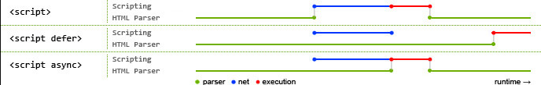

## 浏览器基础

### [事件](https://developer.mozilla.org/zh-CN/docs/Learn/JavaScript/Building_blocks/Events)

- 事件流
	- 事件有捕获阶段（capture），处于目标阶段（target），冒泡阶段（bubble），但是实际事件注册时，只会根据配置决定在某一个阶段执行该回调函数（默认是冒泡）
	- 事件由 html->target->html: 先捕获，再处于目标，再冒泡
	- target 属性 用户获取事件目标 事件加在哪个元素上。（更具体 target.nodeName）
	- 在 DOM 中 event 对象必须作为唯一的参数传给事件处理函数，在 IE 中 event 是 window 对象的一个属性
	- srcElement 属性，用户获取事件目标 事件加在哪个元素上。
- event.stopPropagation()
	- 阻止事件继续向上冒泡
	- (IE 下只只支持 cancelBulble)
- event.preventDefault()
	- 會阻擋預設要發生的事件
	- return false （在事件处理函数中）
			- 功能也是阻止默认事件
			- 只适用于通过 onevent 分配的处理程序
- [EventTarget.addEventListener()](https://developer.mozilla.org/zh-CN/docs/Web/API/EventTarget/addEventListener)
	- 在现代浏览器中，默认情况下，所有事件处理程序都在冒泡阶段进行注册。可以在 addEventListenr 中配置修改事件的处理阶段
	- 当使用 addEventListener() 为一个元素注册事件的时候，句柄里的 this 值是该元素的引用。其与传递给句柄的 event 参数的 currentTarget 属性的值一样。
	- `target.addEventListener(type, listener, options); target.addEventListener( type, // type 属性，用于获取事件类型 listener, (useCapture = false) /* lisenr的触发阶段是否使用捕获阶段，默认冒泡*/ );`
	- addEventListener 的可选项 passive: true 向浏览器发出信号，表明处理程序将不会调用 preventDefault()。
			- 移动设备上会发生一些事件，例如 touchmove（当用户在屏幕上移动手指时），默认情况下会导致滚动，但是可以使用处理程序的 preventDefault() 来阻止滚动。
			- 因此，当浏览器检测到此类事件时，它必须首先处理所有处理程序，然后如果没有任何地方调用 preventDefault，则页面可以继续滚动。但这可能会导致 UI 中不必要的延迟和 " 抖动 "
			- passive: true 选项告诉浏览器，处理程序不会取消滚动。然后浏览器立即滚动页面以提供最大程度的流畅体验，并通过某种方式处理事件。
			- 对于某些浏览器（Firefox，Chrome），默认情况下，touchstart 和 touchmove 事件的 passive 为 true
- Event 对象的一些兼容性写法
	- 获得 event 对象兼容性写法
			- `event || (event = window.event);`
	- 获得 target 兼容型写法
			- `event.target||event.srcElement`
	- 阻止浏览器默认行为兼容性写法 (returnValue 是 ie 的)
			- `event.preventDefault ? event.preventDefault() : (event.returnValue = false);`
	- 阻止冒泡写法
			- `event.stopPropagation ? event.stopPropagation() : (event.cancelBubble = true);`
- 事件委托
	- 利用事件流，在父节点上绑定事件，事件会冒泡到父节点，通过 event.target 来判断是否是指定节点触发的事件，从而避免一个个元素绑定事件

### [跨域](https://www.ruanyifeng.com/blog/2016/04/same-origin-policy.html)

#### CORS

跨域标准解决方案是 CORS，原理是服务端配置一系列 CORS 响应头，声明允许哪些来源、请求方法、自定义请求头发起跨域调用。最核心的是 Access-Control-Allow-Origin，用来放行指定域名。

该配置有两种实现方式：一是后端业务代码里添加响应头；二是在 Nginx 网关层统一配置，全局生效，推荐后者。

浏览器把跨域 AJAX 请求分成两类：

1. 简单请求

	为兼容传统网页表单提交等历史场景做了豁免，仅限 GET、HEAD、POST 三种请求方式；同时不能携带自定义请求头，POST 的 Content-Type 也只能是表单默认的三种类型。

	该类请求不会发送 OPTIONS 预检，真实请求会直接发到后端执行逻辑，后端处理完成返回响应后，浏览器才校验 CORS 头，校验不通过仅拦截 JS 读取返回数据。

2. 复杂请求

	会先发一次 OPTIONS 预检请求做跨域校验，这一次不会携带业务参数、也不会执行后端业务逻辑；浏览器校验预检响应里的 CORS 规则不通过，就直接拦截真实业务请求，不会再向后端发送。

#### [JSONP](https://github.com/YvetteLau/Step-By-Step/issues/30#issuecomment-907615001)

尽管浏览器有同源策略，但是 \<script\> 标签的 src 属性不会被同源策略所约束，可以获取任意服务器上的脚本并执行。jsonp 通过插入 script 标签的方式来实现跨域，参数只能通过 url 传入，仅能支持 get 请求。

跨域场景下前端无法读取 script 接口的原始响应，因此后端需要把数据包裹成全局函数调用语句返回，浏览器加载 script 后自动执行该函数，前端预先定义好同名全局回调，以此拿到跨域数据。

实现原理

- Step1: 创建 callback 方法
- Step2: 插入 script 标签
- Step3: 后台接受到请求，解析前端传过去的 callback 方法，返回该方法的调用，并且数据作为参数传入该方法
- Step4: 由于将接口调用放在 script 脚本里面，浏览器加载完后，会将接口返回的内容，作为 script 脚本执行

jsonp 源码实现

```javascript
const jsonp = function(url, data) {
  return new Promise((resolve, reject) => {
    // 初始化url
    let dataString = url.indexOf('?') === -1 ? '?' : '&';
    let callbackName = `jsonpCB_${Date.now()}`;
    url += `${dataString}callback=${callbackName}`;
    if (data) {
      // 有请求参数，依次添加到url
      for (let k in data) {
        url += `&${k}=${data[k]}`;
      }
    }
    let jsNode = document.createElement('script');
    jsNode.src = url; // 触发callback，触发后删除js标签和绑定在window上的callback
    window[callbackName] = (result) => {
      delete window[callbackName];
      document.body.removeChild(jsNode);
      if (result) {
        resolve(result);
      } else {
        reject('没有返回数据');
      }
    }; // js加载异常的情况
    jsNode.addEventListener(
      'error',
      () => {
        delete window[callbackName];
        document.body.removeChild(jsNode);
        reject('JavaScript资源加载失败');
      },
      false
    ); // 添加js节点到document上时，开始请求
    document.body.appendChild(jsNode);
  });
};
jsonp('http://192.168.0.103:8081/jsonp', { a: 1, b: 'heiheihei' })
  .then((result) => {
    console.log(result);
  })
  .catch((err) => {
    console.error(err);
  });
```

使用:

```js
function show(data) {
  console.log(data);
}
jsonp({
  url: 'http://localhost:3000/show',
  params: {
    //code
  },
  callback: 'show',
}).then((data) => {
  console.log(data);
});
```

服务端代码 (node):

```js
//express启动一个后台服务
let express = require('express');
let app = express();

app.get('/show', (req, res) => {
  let { callback } = req.query; //获取传来的callback函数名，callback是key
  res.send(`${callback}('Hello!')`);
});
app.listen(3000);
```

### XHR

```js
function getasync(url) {
  // same as original function
  return new Promise((resolve, reject) => {
    const xhr = new XMLHttpRequest();
    xhr.open('GET', url);
    xhr.onload = () => resolve(xhr.responseText);
    xhr.onerror = () => reject(xhr.statusText);
    xhr.send();
  });
}
```

```js
const xhr = XMLHTTPRequest();
```

### CSS 和 JS 的加载与阻塞

- css
	- 阻塞 dom 渲染
- JS
	- 阻塞 dom 解析
	- 在遇到 script 标签时会触发页面渲染，如果前面有 css，则会等待其加载完毕再执行脚本

### 资源异步加载和预加载

[参考](https://www.luoyelusheng.com/post/%E6%B7%B1%E5%BA%A6%E8%A7%A3%E6%9E%90%E4%B9%8B%E5%BC%82%E6%AD%A5%E5%8A%A0%E8%BD%BD(defer%E3%80%81async%E3%80%81module)%E5%92%8C%E9%A2%84%E5%8A%A0%E8%BD%BD(preload%E3%80%81prefetch%E3%80%81dns-prefetch%E3%80%81preconnect%20%E3%80%81prerender)/)



- defer

		- `defer`是在解析到结束到 `</html>`标签后才会执行,俗称 `推迟执行脚本`,多个 `defer`可以按顺序执行,例如 `defer1`和 `defer2`可以按顺序执行(实际上也不保证顺序执行)
		- 延迟到文档解析后，domContentLoaded 执行前执行 （可以获取到所有 dom 对象）
		- 按照顺序一一执行
		- 在 type=module 的脚本中默认 defer
		- 应用：页面核心业务脚本（例如 vue 框架等） → 用 defer（保证顺序、能操作 DOM）
- async

		- `async`是告诉浏览器,它不会操作 `dom`,可以不必等到它下载解析完后再加载页面,也不用等它执行完后再执行其他脚本,俗称 `异步执行脚本`
		- 并行请求，并尽快解析和执行，多个 `async`无法保证他们的执行顺序，
		- 应用：如果资源没有执行顺序依赖，例如独立的库或者说第三方无关脚本 → 用 async
- defer 和 async 共同特点

		- 同时存在时表现形式为 async
		- 只接受 src 的外部脚本
- preload

		- 预加载，尽快加载该资源
- prefetch

		- 页面空闲时加载该资源
- dns-prefetch

		- HTTP 下默认解析 a 链接的域名
		- HTTPS 下需要添加 mata 标签，开启域名解析，不过不建议开启会带来安全隐患
- preconnect

		- 预连接，启动早期连接（包括 DNS 查找，TCP 握手和可选 TLS 协商），优化字体资源加载

#### 页面生命周期事件

页面生命周期事件：

- 当 DOM 准备就绪时，document 上的 DOMContentLoaded

		事件就会被触发。在这个阶段，我们可以将 JavaScript 应用于元素。

		- 诸如 `<script>...</script>` 或 `<script src="..."></script>` 之类的脚本会阻塞 `DOMContentLoaded`，浏览器将等待它们执行结束。
		- 图片和其他资源仍然可以继续被加载。
- 当页面和所有资源都加载完成时，`window` 上的 `load` 事件就会被触发。我们很少使用它，因为通常无需等待那么长时间。
- 当用户想要离开页面时，`window` 上的 `beforeunload` 事件就会被触发。如果我们取消这个事件，浏览器就会询问我们是否真的要离开（例如，我们有未保存的更改）。
- 当用户最终离开时，`window` 上的 `unload` 事件就会被触发。在处理程序中，我们只能执行不涉及延迟或询问用户的简单操作。正是由于这个限制，它很少被使用。我们可以使用 `navigator.sendBeacon` 来发送网络请求。
- document.readyState 是文档的当前状态，可以在 readystatechange

		事件中跟踪状态更改：

		- `loading` —— 文档正在被加载。
		- `interactive` —— 文档已被解析完成，与 `DOMContentLoaded` 几乎同时发生，但是在 `DOMContentLoaded` 之前发生。
		- `complete` —— 文档和资源均已加载完成，与 `window.onload` 几乎同时发生，但是在 `window.onload` 之前发生。

### 浏览器执行时间线

根据 js 执行那一刻开始的执行顺序 浏览器加载的时间线

1.创建 document 对象，开始解析 web 页面 这时 document.readyState 等于’loading’

2.遇到 link 标签（外部引用 css）创建线程加载，并继续解析文档， 即异步加载

3.遇到非异步的 script 标签，浏览器加载并阻塞，等待 js 加载完成

4.遇到异步的 script 标签，浏览器创建线程加载，并继续解析文档。对于 async 属性的脚本，脚本加载完成后立即执行；对于 defer 属性的脚本，脚本等到页面加载完之后再执行（异步禁止使用 document.write）

5.遇到 img 等，先正常解析 dom 结构，然后浏览器异步加载 src，并继续解析文档

6.当文档解析完成之后（即 renderTree 构建完成之后， 此时还未下载完对吧），document.readyState=‘interative’。活跃的 动态的

7.文档解析完成后，所有设置有 defer 的脚本会按照顺序执行。

8.文档解析完成之后 页面会触发 document 上的一个 DOMContentLoad 事件

9.当页面所有部分都执行完成之后 document.readyState =‘complete’ 之后就可以执行 window.onload 事件了

### [页面的重绘和回流以及优化](https://segmentfault.com/a/1190000017329980#articleHeader11)

回流（reflow）：当 DOM 元素的内容，结构，位置或大小发生变化的时候，需要重新计算样式和渲染树。（计算属性、布局（盒子模型相关）的属性、窗口大小，）

　　重绘（repaint）：元素发生的改变，只影响了节点的一些样式，如：visibility、outline、背景颜、色等。只需要应用新样式绘制这个元素。

　　注：回流的开销大于重绘，一个节点的回流通常会导致它的子节点和统计节点的回流。

#### 触发回流的操作

- 添加或删除可见的 DOM 元素
- 元素的位置发生变化
- 元素的尺寸发生变化（包括外边距、内边框、边框大小、高度和宽度等）
- 内容发生变化，比如文本变化或图片被另一个不同尺寸的图片所替代。
- 页面一开始渲染的时候（这肯定避免不了）
- 浏览器的窗口尺寸变化（因为回流是根据视口的大小来计算元素的位置和大小的）

现代的浏览器都是很聪明的，由于每次重排都会造成额外的计算消耗，因此大多数浏览器都会通过队列化修改并批量执行来优化重排过程。浏览器会将修改操作放入到队列里，直到过了一段时间或者操作达到了一个阈值，才清空队列。但是！当你获取布局信息的操作的时候，会强制队列刷新，比如当你访问以下属性或者使用以下方法：offsetLeft / offsetTop / offsetWidth / offsetHeight / scrollTop/Left/width/height / clientTop/Left/width/height 等。

#### 触发重绘的操作

因为回流引起的重绘。

- 颜色、背景、outline 相关的。
- 浏览器的自带优化：浏览器会维护一个队列，把所有的会引起回流或重绘的操作放到里面。等队列中的操作到了一定数量的时候或者到了一定时间间隔的时候就会一起执行这些操作，这样就让多次回流和重绘合并成一次。
- 开发者优化：尽量减少不必要的 DOM 操作修改，减少对一些 style 信息的请求。
- 避免逐个修改节点样式，尽量一次性修改。
- 将需要多次修改的 DOM 设置为 display:none；后修改，然后再显示（因为隐藏元素不在渲染树里面，所以修改隐藏元素不会触发回流和重绘）。
- 避免多次读取元素的某些属性。
- 将复杂的节点元素设置脱离文档流，降低回流成本。

## 浏览器输入 URL 后发生了什么

- [[HTTP#缓存]]
	- 浏览器发起请求前，先检查该资源在本地是否有 `强缓存`（Expires/Cache-Control）：
		- 未过期：直接读取本地磁盘 / 内存缓存，不发网络请求，页面秒加载；
		- 强缓存失效，走协商缓存；
	- 协商缓存：带上 If-Modified-Since / If-None-Match 发给服务端；（这里是后续步骤，只不过为了好记忆，一快写了，这里需要建立了连接后根据服务端响应才能判断）
		- 资源没改动：服务端返回 `304 Not Modified`，浏览器复用本地缓存；
		- 资源已更新：返回 200 + 最新资源，浏览器更新本地缓存；
- DNS 解析
	1. 流程
		1. 浏览器缓存：首先会检查浏览器是否有缓存。
		2. 本地 hosts 文件：找本地 hosts 文件里是否有对应的 IP 地址。
		3. 本机系统缓存：去本机系统缓存里面查找。
		4. 本地 DNS 服务器：如果以上都没有，就去本地 DNS 服务器进行递归查询。
				(a) 如果 DNS 服务器有缓存，就直接返回。
				(b) 如果没有缓存，它就会沿着根域名服务器、顶级域名服务器和对应的权威域名服务器，一路进行迭代查询，直到找到最终对应的 IP 地址，然后再一路返回。
	- 细节点
		- 查询区分：客户端 ↔ 本地 DNS 是递归查询（一次请求等最终结果）；各级 DNS 服务器之间是迭代查询（逐级指引下一跳）。
		- 本地 DNS 依靠任播就近接入、自带共享缓存，既能大幅减轻根服务器压力，又能降低解析延迟。
- [[TCP-UDP#三次握手]]
	- 三次握手
		- 确认双方收发正常
- [[HTTP#原理]]
	- 依靠证书里完成服务器身份验证，然后协商出对称密钥，之后 HTTPS 真实数据全部用这个对称密钥加密传输。
- 发送 HTTP 请求报文
- 服务器处理请求并返回响应 HTTP 报文
- 传输结束，TCP 四次挥手断开连接
	- 一个是因为服务端在接收到结束信号时，无法确定当前的报文已经传输完成了，所以只能先确认收到结束信号了，还要在自己这边确认传输完成了再发送一个服务端也可以结束的信息
- 浏览器接收后后解析渲染页面
	- 解析 HTML 并将其生成 DOM 树，同时将 CSS 生成 CSSOM。将 DOM 树中的可见节点结合 CSSOM 中计算出的 Computed Style，生成 Render Tree（渲染树）。
	- 布局计算
		- 基于 Render Tree 进行布局操作，计算出每个节点的位置、大小等布局信息。
	- 合成层提升
		- 依据 `z-index`、transform、opacity、will-change、3D 变换、滤镜等规则，把对应元素划分成独立合成层；
		- 每个合成层拥有独立的绘制上下文，后续各自生成专属位图。
		- 注意：仅对整个图层做位移、透明度动画时，不会触发页面其余元素重排重绘；但修改图层内部元素布局样式，仍会触发图层内局部重排。
	- 绘制（Paint）
		- 提升完合成层后，会进行 Paint 绘制操作，生成每个合成层的绘制列表。
	- GPU 进行光栅化生成位图，然后合并图层，跟随屏幕刷新输出画面
		- 主线程生成完各图层绘制指令后，交给 GPU 做硬件光栅化，再按 CSS 层级顺序合并图层，跟随屏幕刷新输出画面，这一步全程不阻塞 JS 主线程。
			- 分块（Tiling）
				- 将绘制列表提交到合成器线程（Compositor Thread），并进行分块操作。将大区域拆分成小块，并优先渲染当前可见区域的块。
			- 光栅化（Raster）
				- 基于这些块，在 GPU 进程中进行光栅化处理，将绘制列表转化为位图。
			- 层级合并
				- 光栅化完成后，将不同层级的位图，GPU 按照 CSS 层叠上下文、z-index 堆叠顺序叠加所有图层位图进行合并展示，得到最终要渲染到屏幕上的像素点颜色。
			- 显示器渲染
				- 得到绘制块后，根据显示器的刷新频率，在合适的渲染时机进行底层的显示输出。
