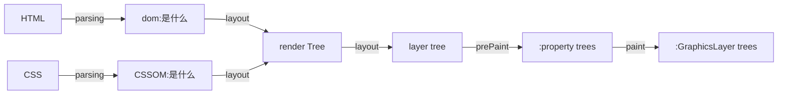
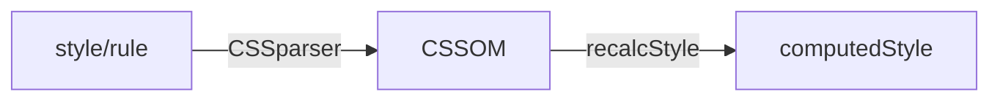

# 浏览器结构

1. shell 外壳、例如菜单和工具栏等
2. 内核

## 内核

1. 渲染引擎 layout engineer 或者 rendering engine 和 JS 引擎
2. 常见渲染引擎：

| 浏览器  | 渲染引擎        | JS 引擎        |
| ------- | --------------- | -------------- |
| IE      | Trident         | Chakra         |
| Edge    | EdgeHTML        | Chakra         |
| Firefox | Gecko           | SpiderMonkey   |
| Chrome  | Webkit -> Blink | V8(著名的)     |
| Safri   | Webkit          | Javascriptcore |
| Opera   | Presto->Blink   | Carakan        |

注：新版本的 Chrome 采用的渲染引擎是 Blink，Blink 是由谷歌团队从 Webkit 衍生开发出来的引擎，主要有应用到 Chrome 和 Opera 浏览器。

## 进程与线程

进程和进程之间是相互隔离

- 当一个页面或插件崩溃的时候，影响到的仅仅是当前的页面进程或者插件进程，并不会影响到其他页面。
- 每新打开一个页面都会为其新建一个渲染进程。JS 也是运行在渲染进程中，即便是 JS 阻塞了渲染进程，它影响的也只是当前的页面
- 当关闭这个页面时，这个进程所占用的所有内存会被系统回收，所以根本不存在内存泄漏的问题。
- 选项卡中的每个跨站点 iframe 都会获得单独的渲染器进程。
- Chrome 把插件进程和渲染进程锁在沙箱里面，这样即使在渲染进程或者插件进程里面执行了恶意程序，恶意程序也无法突破沙箱去获取系统权限

通信

- 用 IPC (Inter Process Communication)。
  - 通过 stdin/stdout 传递 json：最直接的方式，适用于能够拿到“子”进程 handle 的场景，适用于关联进程之间通信，无法跨机器
  - Node 原生 IPC 支持：最 native（地道？）的方式，比上一种“正规”一些，具有同样的局限性
  - 通过 sockets：借助网络来完成进程间通信，不仅能跨进程，还能跨机器,最通用的方式，有良好的跨环境能力，但存在网络的性能损耗
  - 借助 message queue：最强大的方式，既然要通信，场景还复杂，不妨扩展出一层消息中间件，漂亮地解决各种通信问题

多数程序被设计成使用 IPC 来进行进程间的通信，好处在于当一个进程给另一个进程发消息而没有回应时，并不影响当前的进程继续工作。

## 浏览器结构


从图中可以看出，现在的 Chrome 架构中包括下面几个进程：

- **浏览器进程。**负责界面展示，用户交互，子进程管理，文件存取等

  (控制地址栏、书签前进后退按钮，标签页创建/销毁、页面显示、网络请求、资源管理下载、绘制渲染进程的位图)

  - UI thread：绘制浏览器顶部按钮和导航栏输入框等组件
  - network thread：处理网络请求，从网上获取数据；
  - storage thread： 控制文件等的访问；

- **GPU/Viz （Graphics Processing Unit）进程。**其实，Chrome 刚开始发布的时候是没有 GPU 进程的。而 GPU 的使用初衷是为了实现 **3D CSS** 的效果，只是随后网页、Chrome 的 UI 界面都选择采用 GPU 来绘制，这使得 GPU 成为浏览器普遍的需求。最后，Chrome 在其多进程架构上也引入了 GPU 进程。

  - Raster

- **网络进程。**主要负责页面的网络资源加载，之前是作为一个模块运行在浏览器进程里面的，直至最近才独立出来，成为一个单独的进程。

- **插件进程。**主要是负责插件的运行，因插件易崩溃，所以需要通过插件进程来隔离，以保证插件进程崩溃不会对浏览器和页面造成影响。

- **utility 进程**
  - 有时候浏览器主进程需要做一些“危险”的事情，比如图片解码、文件解压缩。如果这些“危险”的操作发生了失败，会导致整个主进程发生异常崩溃，这是我们不愿意看到的。因此 Chromium 设计出了一个 utility 进程的机制。主进程临时需要做一些不方便的任务的情况下，可以启动一个 utility 进程来代替主进程执行
  - V8 代理解析工具，它是干什么用的呢？Chrome 支持使用 JavaScript 来写连接代理服务器脚本，又称为在线 PAC 代理脚本，使用 PAC 代理脚本可以实现一些会被请去喝茶的事情。刚开始的时候，Chrome 是在浏览器进程里面解析 PAC 代理脚本的，由于是 JavaScript 脚 本，所有需要在浏览器进程里面引入 V8，不过把 V8 运行在浏览器进程似乎不太好，于是 Chrome 团队后来就把这个功能独立出来一个进程了，这个进程就叫“Utility: V8 Proxy Resolver”。
- shared worker 线程
- **渲染进程。**核心任务是将 HTML、CSS 和 JavaScript 转换为用户可以与之交互的网页，排版引擎 Blink 和 JavaScript 引擎 V8 都是运行在该进程中，默认情况下，Chrome 会为每个 Tab 标签创建一个渲染进程。出于安全考虑，渲染进程都是运行在**沙箱模式**下,与操作系统隔离，增加安全性。

  - 一个主线程（main thread）
  - 多个工作线程（work thread）
  - 一个合成器线程（compositor thread）：在 GUI 渲染线程后执行，将 GUI 渲染线程生成的带绘制列表转换为位图。
  - 多个光栅化线程（raster thread）
  - IO 线程：用来和其他进程进行通信
  - **GUI 渲染线程**
    - HTML Parser 解析 HTML 文档，将元素转换为树结构 DOM 节点
    - CSS Parser 解析 Style 数据，包括外部的 CSS 文件以及在 HTML 元素中的样式，用于创建渲染树
    - Layout 为每个节点计算出在屏幕中展示的准确坐标
    - Painting 遍历渲染树，调用 UI Backend 提供的接口绘制每个节点
  - **JavaScript 引擎线程**
    - 解析 Javascript 脚本，运行代码 JS 引擎一直等待着任务队列中任务的到来，然后加以处理，一个 Tab 页（renderer 进程）中无论什么时候都只有一个 JS 线程在运行 JS 程序
    - GUI 渲染线程与 JS 引擎线程互斥
      - 由于 JavaScript 是可操纵 DOM 的，如果在修改这些元素属性同时渲染界面（即 JS 线程和 GUI 线程同时运行），那么渲染线程前后获得的元素数据就可能不一致了。为了防止渲染出现不可预期的结果，浏览器设置 GUI 渲染线程与 JS 引擎为互斥的关系，当 JS 引擎执行时 GUI 线程会被挂起，GUI 更新则会被保存在一个队列中等到 JS 引擎线程空闲时立即被执行
  - **定时触发器线程**
    - setInterval 与 setTimeout 所在线程
    - 定时计数器并不是由 JavaScript 引擎计数的(因为 JavaScript 引擎是单线程的, 如果处于阻塞线程状态就会影响记计时的准确, 因此通过单独线程来计时并触发定时更为合理)
    - W3C 在 HTML 标准中规定，规定要求 setTimeout 中低于 4ms 的时间间隔算为 4ms
  - **事件触发线程**
    - 归属于浏览器而不是 JS 引擎，用来控制事件循环 event loop 中的队列
    - 一个事件被触发时该线程会把事件添加到待处理队列的队尾，等待 JavaScript 引擎的处理。
    - 这些事件可以是当前执行的代码块如定时任务(也可来自浏览器内核的其他线程如鼠标点击、AJAX 异步请求等),会将对应任务添加到事件线程中
  - **http 异步请求线程**
    - XMLHttpRequest 在连接后是通过浏览器新开一个线程请求， 将检测到状态变更时，如果设置有回调函数，异步线程就产生状态变更事件放到 JavaScript 引擎的处理队列中等待处理

## Chromium & [Blink](https://juejin.cn/post/6844904143279095822#heading-5)

宽泛的说，Blink 实现了在浏览器页签中所有的渲染工作，其中包括：

- 实现了 Web 平台中的标准，例如 HTML 标准，包括 DOM、CSS 等。
- 内置了 V8 引擎用于运行 JavaScript。
- 从网络堆栈中获取资源
- 构建 DOM 树
- 计算样式和布局
- 内置了[Chrome Compositor](https://chromium.googlesource.com/chromium/src/+/HEAD/cc/README.md)和绘制图形的能力

借助[Content public APIs](https://chromium.googlesource.com/chromium/src/+/HEAD/content/public/README.md)，Blink 可以被内置在很多诸如 Chromium，Android WebView 和 Opera 这样的应用中。

## 面向服务的架构

Chrome 将架构从多进程模型转变成面向服务。浏览器将功能以服务的方式提供，以解决多进程架构中的问题。


当 Chrome 运行在拥有强大硬件的计算机上时，会将一个服务以多个进程的方式实现，提高稳定性，当计算机硬件资源紧张时，则可以将多个服务放在一个进程中节省资源。

### 多进程架构优化

之前的我们说到，`Renderer Process`的作用是负责一个 Tab 内的显示相关的工作，这就意味着，一个 Tab，就会有一个 Renderer Process，这些进程之间的内存无法进行共享，而不同进程的内存常常需要包含相同的内容。

#### 浏览器的进程模式

为了节省内存，Chrome 提供了四种进程模式（Process Models），不同的进程模式会对 tab 进程做不同的处理。

- **Process-per-site-instance** (default) - 同一个 **site-instance** 使用一个进程
- **Process-per-site -** 同一个 **site** 使用一个进程
- **Process-per-tab -** 每个 tab 使用一个进程
- **Single process -** 所有 tab 共用一个进程

这里需要给出 site 和 site-instance 的定义

- **site** 指的是相同的 registered domain name(如： google.com ，bbc.co.uk)和 scheme (如：https://)。比如 a.baidu.com 和 b.baidu.com 就可以理解为同一个 site（注意这里要和 [Same-origin policy](https://developer.mozilla.org/en-US/docs/Web/Security/Same-origin_policy) 区分开来，同源策略还涉及到子域名和端口）。

- site-instance 指的是一组 connected pages from the same site，这里 connected 的定义是 can obtain references to each other in script code 怎么理解这段话呢。满足下面两中情况并且打开的新页面和旧页面属于上面定义的同一个 site，就属于同一个

  site-instance

  - 用户通过`<a target="_blank">`这种方式点击打开的新页面

- JS 代码打开的新页面（比如 `window.open`)

理解了概念之后，下面解释四个进程模式

首先是`Single process`，顾名思义，单进程模式，所有 tab 都会使用同一个进程。接下来是`Process-per-tab` ，也是顾名思义，每打开一个 tab，会新建一个进程。而对于`Process-per-site`，当你打开 a.baidu.com 页面，在打开 b.baidu.com 的页面，这两个页面的 tab 使用的是共一个进程，因为这两个页面的 site 相同，而如此一来，如果其中一个 tab 崩溃了，而另一个 tab 也会崩溃。

`Process-per-site-instance` 是最重要的，因为这个是 Chrome 默认使用的模式，也就是几乎所有的用户都在用的模式。当你打开一个 tab 访问 a.baidu.com ，然后再打开一个 tab 访问 b.baidu.com，这两个 tab 会使用**两个进程**。而如果你在 a.baidu.com 中，通过 JS 代码打开了 b.baidu.com 页面，这两个 tab 会使用**同一个进程**。

#### 默认模式选择

那么为什么浏览器使用`Process-per-site-instance`作为默认的进程模式呢？

`Process-per-site-instance`兼容了性能与易用性，是一个比较中庸通用的模式。

- 相较于 Process-per-tab，能够少开很多进程，就意味着更少的内存占用
- 相较于 Process-per-site，能够更好的隔离相同域名下毫无关联的 tab，更加安全

参考：链接：https://juejin.cn/post/6844904158131126279

### 从输入 URL 到页面展示

- 首先，在输入框输入 `www.mysite.com` 然后输入 `Enter` 这些都是由**浏览器进程的 UI thread** 来负责处理的，其中还有个额外的处理就是判断输入是一个 URL 还是个 Query，无论是哪个都要通过 IPC 通知网络进程发送请求，只不过请求的目标不一样（输入的 URL / 搜索引擎）。

- ui 线程预先**准备一个渲染线程**
- 如果响应的主体是一个 HTML 文件，浏览器会将获取的响应数据交给**渲染进程**（renderer process）来进行下一步的工作。如果拿到的响应数据是一个压缩文件（zip file）或者其他类型的文件，响应数据就会交给下载管理器（download manager）来处理。

[浏览器多进程架构](https://zhuanlan.zhihu.com/p/102128787)

## 浏览器的任务管理器


总结：

- `Blink` 负责网页内容的绘制，`cc` 负责将绘制的结果进行合成并提交到 `Viz`。

- Blink —> `Paint` -> `Commit` -> (`Tiling` ->) `Raster` -> `Activate` -> `Draw(Submit)` —> Viz

  Blink 对接 `cc` 的绘制接口进行 `Paint`，Paint 生成 cc 模块的**数据源**（`cc::Layer`），CC 将数据源进行合成，经过一系列过程最终在 `Draw` 阶段将合成的结果(`viz::CompositorFrame`)提交到 `Viz`。 也就是说，`Blink` 负责网页内容的绘制，`cc` 负责将绘制的结果进行合成并提交到 `Viz`。

- `Blink` 负责浏览器网页部分的绘制，`//ui/views` 模块负责浏览器非网页部分 UI 的绘制，它们的绘制都对接 cc。如果我们扩展 `//ui/views` 的能力，就可以在 cc 之上建立一套新的 UI 框架，比如我们把这套新的 UI 框架叫做 `Flutter`。真正的 `Flutter` 当然没有这么简单，但其实 Flutter 最初是由 Chromium 的开发人员建立的（信息来自网络，未求证），所以 Flutter 渲染流水线或多或少的会吸取 Chromium 渲染的经验。最近 UC 内核团队开始投入 Flutter 的研究也算他们团队的一个新方向了。

# 渲染流水线




https://keqingrong.github.io/blog/2019-11-24-concepts-related-to-web-browsers

- Parse/DOM：将 Content 解析成 DOM 树，它是后面各个渲染流程的基础。
- Style：解析并应用样式表。
- Layout：布局。
- Compositing update：将整个页面按照一定规则，分成独立的图层，便于隔离更新。
- prepaint：构建属性树，使得可以单独操作某个节点（变换、裁剪、特效、滚动），不至于影响它的子节点。
- paint：paint 这个单词名词有油漆、颜料的含义。动词有用颜料画等含义。这里我觉得使用它的名词含义比较贴切，Paint 操作会将布局树（Layout Tree）中的节点（Layout Object）转换成绘制指令（例如绘制矩形、绘制字体、绘制颜色，这有点像绘制 API 的调用）的过程。然后把这些操作封装在 Dsipaly Item 中，所以这些 Display Item 就像是油漆，它还没有真正的开始粉刷（绘制 Draw）。
- Commit：commit 会把 paint 阶段的数据拷贝的合成器线程。
- Tiling：raster 接收到 paint 阶段的绘制指令之后，会先对图层进行分块。图块是栅格化（Raster）的基本工作单位。
- Raster：栅格化。
- Activate：栅格化是个异步的过程，因而图层树（Layer Tree）被分为了 Pending Tree（负责接收 Commit 提交的 Layer 进行栅格化操作）和 Activate Tree（从这里取出栅格化的 Layer 进行 Draw 操作），从 Pending Tree 拷贝 Layer 到 Activate Tree 的过程就叫做 Activate。
- Draw：这里要和上面的 Paint 区分开来了，图块被栅格化以后，合成器线程会为每个图块生成 draw quads（quads 有四边形之意，它代表了在屏幕特定位置绘制图块的指令，包含属性树里面的变换、特效等信息），这些 draw quads 被封装到 Compositor Frame 中输出给 GPU，Draw 操作就是生成 draw quads 的过程。
- Display：生成了 Compositor Frame 以后，Viz 会调用 GL 指令把 draw quads 最终输出到屏幕上。

## Parse HTML

[Dom](https://chromium.googlesource.com/chromium/src/+/master/third_party/blink/renderer/core/dom/README.md)

`Node`是节点树中所有类型节点的基类。每个`Node`都有以下 3 个指针（但不限于）：

- `parent_or_shadow_host_node_`：指向父级（如果是影子根，则指向影子主机；稍后说明）
- `previous_`：指向上一个同级
- `next_`：指向下一个兄弟姐妹

`ContainerNode`从`Element`扩展，为其子级提供了其他指针：

- `first_child_`：含义很明显。
- `last_child_`：尼特。

NodeTraversal never cross a shadow boundary, `──/`.

这意味着：

- Siblings 是 linked list 类型. 获取 parent's n-th child 需要 O(N)
- 不能在 O（1）下获取 parent 的所有子

### Composed Tree (a tree of node trees)

**shadow tree**的根节点是`ShadowRoot`

- `Document` 和 `ShadowRoot` 总是节点树的根，并且 implements `TreeScope`.
- TreeScope 具有 ID 到元素的映射
-

* DOM 树没构建完成之前，若 CSSOM 解析完成，CSSOM 解释器的结果会保存起来
* DOM 树的构建过程是一个深度遍历过程，即当前节点的所有子节点都构建好后才会去构建当前节点的下一个兄弟节点

### [Shadow tree](https://zh.javascript.info/shadow-dom#shadowtree)

一个 DOM 元素可以有以下两类 DOM 子树：

1. Light tree（光明树） —— 一个常规 DOM 子树，由 HTML 子元素组成。我们在之前章节看到的所有子树都是「光明的」。

2. Shadow tree（影子树） —— 一个隐藏的 DOM 子树，不在 HTML 中反映，无法被察觉。

如果是内联样式，CSSOM 构建包含在*Parse HTML*过程中

如果是外部样式，包含在*Parse Stylesheet*过程中

如果没有设置样式，使用*User Agent Style*，则包含在*Parse HTML*过程中

## Recalc Style



1. 解析 CSS，处理选择器与声明。[CSSParser](https://cs.chromium.org/chromium/src/third_party/blink/renderer/core/css/parser/css_parser.h?q=CSSParser&dr=CSs)
2. 生成样式表内容，包含多种样式规则。StyleSheetContents&StyleRule
   - 不同的样式规则均设置了方便查找的索引或类名。比如 [CSSSelectorList](https://cs.chromium.org/chromium/src/third_party/blink/renderer/core/css/css_selector_list.h?q=CSSSelectorList&dr=CSs) & [CSSPropertyValueSet](https://cs.chromium.org/chromium/src/third_party/blink/renderer/core/css/css_property_value_set.h?q=CSSPropertyValueSet&dr=CSs)
   - CSS 属性类由一些 py 脚本在构建时自动生成。[make_css_property_subclasses.py](https://cs.chromium.org/chromium/src/third_party/blink/renderer/build/scripts/core/css/properties/make_css_property_subclasses.py?dr&g=0)
3. Style 将 document 中解析后的样式规则(StyleSheetContents)与由浏览器提供的默认样式结合，重新计算。 [Document::UpdateStyle](https://cs.chromium.org/chromium/src/third_party/blink/renderer/core/dom/document.h?type=cs&q=Document::UpdateStyle&g=0&l=1705) & [StyleResolver::StyleForElement](https://cs.chromium.org/chromium/src/third_party/blink/renderer/core/css/resolver/style_resolver.h?type=cs&q=StyleResolver::StyleForElement&g=0&l=69)
4. 在为每个 DOM 元素计算最终的样式属性后，将结果保存在一个大对象 ComputedStyle 中。[ComputedStyleModel](https://cs.chromium.org/chromium/src/third_party/devtools-frontend/src/front_end/elements/ComputedStyleModel.js?q=ComputedStyle&dr=CSs)

- 可以在 Chrome 开发者工具中观察任何元素的 computed style，也有暴露的 JS 接口: getComputedStyle(element)，由 blink 提供

### CSS Object Model (CSSOM)


CSS 对象模型（CSSOM），在 W3C 标准中，它包含两个部分：

- 描述样式表和规则等 CSS 的模型部分（CSSOM）
- 跟元素视图相关的 View 部分（CSSOM View）。

* 在[CSS Houdini](https://developers.google.com/web/updates/2016/05/houdini)中的[CSSOM](https://drafts.css-houdini.org/css-typed-om/)，阅读 Google 开发者文档中[@Eric Bidelman](https://developers.google.com/web/resources/contributors/ericbidelman)写的[博文](https://developers.google.com/web/updates/2018/03/cssom)。我们可以使用`.attributeStyleMap`属性来替代`ele.style`。可以使用`ele.attributeStyleMap.set(property, value)`来设置元素内联样式：

  ```
  $0.attributeStyleMap.set('background-color', 'green')
  ```

  而在新的 CSSOM 中有一个新的 API，可以让我们获取计算值。比如：

  ```
  el.computedStyleMap().get('opacity').value // => 0.5
  ```

  > 注意，`window.getComputedStyle()`和`ele.computedStyleMap()`的差别是，前者返回的是解析值，而后值返回计算值。类如，如果你的样式中有一个这样的值，`width: 50%`，那么在**Typed OM**中将保留百分值（`width: 50%`）;而 CSSOM 中返回的是解析值（`width: 200px`）。

- 浏览器 CSS 匹配核心算法的规则是以`从右向左`方式匹配节点的。这样做是为了减少无效匹配次数，从而匹配快、性能更优。

#### [CSS 操作](https://wangdoc.com/javascript/dom/css.html)

修改样式表中的内容。

document.styleSheets[0].insertRule("p { color:pink; }", 0)

document.styleSheets[0].removeRule(0)

innerHeight、innerWidth 和 devicePixelRatio


#### **CSSStyleDeclaration 接口**：


- 特性：

  - 如果读取 CSS 原始的属性名，要用方括号运算符，比如`styleObj['z-index']`；如果读取骆驼拼写法的 CSS 属性名，可以直接读取`styleObj.zIndex`。
  - 属性值都是字符串
  - 如果 CSS 属性名是 JavaScript 保留字，则规则名之前需要加上字符串 css，比如 float 写成 cssFloat
  - CSSStyleDeclaration 实例返回的 CSS 值都是绝对单位。比如，长度都是像素单位（返回值包括`px`后缀），颜色是`rgb(#, #, #)`或`rgba(#, #, #, #)`格式
  - CSS 规则的简写形式无效。比如，想读取`margin`属性的值，不能直接读，只能读`marginLeft`、`marginTop`等属性；再比如，`font`属性也是不能直接读的，只能读`font-size`等单个属性。
  - 该方法返回的 CSSStyleDeclaration 实例的`cssText`属性无效，返回`undefined`。
  - 也可以使用 CSSStyleDeclaration 实例的`getPropertyValue`方法，获取伪元素的属性

- 应用接口

  - el.style（只是获取的行内样式，不是全部样式） // 可读、可写

  - document.styleSheets[0].cssRules[0].style;

  - ```javascript
    style = window.getComputedStyle(dom, ':after') // 只可读
    ```

#### StyleSheet 接口

- `StyleSheet`接口代表网页的一张样式表，包括`<link>`元素加载的样式表和`<style>`元素内嵌的样式表。

- ```javascript
  var sheets = document.styleSheets
  ```

#### CSSRuleList 接口{CSSRuls}

- 表示一组 CSS 规则，成员都是 CSSRule 实例。
- 

- ```javascript
  var myStyleSheet = document.getElementById('myStyle').sheet
  var crl = myStyleSheet.cssRules
  crl instanceof CSSRuleList // true
  ```

#### CSSStyleRule 接口

- 如果一条 CSS 规则是普通的样式规则（不含特殊的 CSS 命令），那么除了 CSSRule 接口，它还部署了 CSSStyleRule 接口。

* CSSOM，即 CSS Object Model，CSS 对象模型，是对 CSS 样式表的对象化表示，同时还提供了相关 API 用来操作 CSS 样式。
* `element.style`只是获取某个元素的内联样式，而非完整的样式表。
* [CSSOM 在 W3C 规范中有一个独立的模块](https://www.w3.org/TR/cssom-1/)
* document.styleSheets


CSS 字节转换成字符，接着转换成令牌和节点，最后链接到一个 CSSOM 的树结构中：


- **`CSSStyleSheet`** 接口代表一个 [CSS](https://developer.mozilla.org/zh-CN/docs/Web/CSS) 样式表，并允许检查和编辑样式表中的规则列表。它从父类型 [`StyleSheet`](https://developer.mozilla.org/zh-CN/docs/Web/API/StyleSheet) 继承属性和方法。

  ### 共享 computedStyle

  在特定情况下，浏览器会共享 computedStyle，网页中能共享的标签非常多，所以能极大的提升执行效率！如果能共享，那就不需要执行匹配算法了，执行效率自然非常高。

  也就是说：如果两个或多个 element 的 computedStyle 不通过计算可以确认他们相等，那么这些 computedStyle 相等的 elements 只会计算一次样式，其余的仅仅共享该 computedStyle 。

  那么有哪些规则会共享 computedStyle 呢？

  - 该共享的 element 不能有 id 属性且 CSS 中还有该 id 的 StyleRule.哪怕该 StyleRule 与 Element 不匹配。

  - tagName 和 class 属性必须一样;

  - mappedAttribute 必须相等;

  - 不能使用 sibling selector，譬如:first-child, :last-selector, + selector;

  - 不能有 style 属性。哪怕 style 属性相等，他们也不共享;

    ```
    <span><p style="color:red">paragraph1</span></p>
    <span><p style="color:red">paragraph2</span></p>
    ```

  通过上文的了解，我们知道，当 CSS Parser 解析完 CSS 脚本后，会生成 CSSStyleSheetList ，他保存在 Document 对象上。为了更快的计算样式，必须对这些 CSSStyleSheetList 进行重新组织。

  计算样式就是从 CSSStyleSheetList 中找出所有匹配相应元素的 property-value 对。匹配会通过 CSSSelector 来验证，同时需要满足层叠规则。

  将所有的 declaration 中的 property 组织成一个大的数组。数组中的每一项纪录了这个 property 的 selector，property 的值，权重（层叠规则）。

  可能类似如下的表现：

  ```
  p > a {
    color : red;
    background-color:black;
  }
  a {
    color : yellow
  }
  div {
    margin : 1px;
  }
  ```

重新组织之后的数组数据为(weight 我只是表示了他们之间的相对大小，并非实际值。）

```
   selector      property                       weight
1, a             color:yellow                   1
2, p > a         color:red                      2
3, p > a         background-color:black         2
4, div           margin:1px                     3
```

好了，到这里，我们来解决上述问题：
首先，要明确，内敛样式只是 CSS 三种加载方式之一；
其次，浏览器解析分为两个分支，HTML Parser 和 CSS Parser，两个 Parser 各司其职，各尽其责；
最后，不同的 CSS 加载方式产生的 Style rule ，通过权重来确定谁覆盖谁；

参考：

[浏览器的渲染原理简介](https://coolshell.cn/articles/9666.html)

[浏览器的渲染：过程与原理](https://zhuanlan.zhihu.com/p/29418126)

[浏览器内核、JS 引擎、页面呈现原理及其优化](https://www.zybuluo.com/yangfch3/note/671516)

[探究 CSS 解析原理](https://jartto.wang/2017/11/13/Exploring-the-principle-of-CSS-parsing/)

[浏览器的工作原理：新式网络浏览器幕后揭秘](https://www.html5rocks.com/zh/tutorials/internals/howbrowserswork/#Layered_representation)

[浏览器原理](https://github.com/lhyt/issue/issues/22)

[理解关键的渲染路径](https://www.w3cplus.com/performance/understanding-the-critical-rendering-path.html)

[关键渲染路径](https://github.com/berwin/Blog/issues/29)

https://www.w3cplus.com/javascript/cssom-css-typed-om.html © [w3cplus.com](https://www.w3cplus.com/)

## Layout

layout 模式被 display 属性控制，对于每种不同的 layout，都有不同的 [NGLayoutAlgorithm](https://chromium.googlesource.com/chromium/src/+/master/third_party/blink/renderer/core/layout/ng/ng_layout_algorithm.h).

在执行布局操作的时候，会把布局运算的结果重新写回布局树中，所以布局树既是输入内容也是输出内容，这是布局阶段一个不合理的地方，因为在布局阶段并没有清晰地将输入内容和输出内容区分开来。针对这个问题，Chrome 团队正在重构布局代码，下一代布局系统叫 LayoutNG，试图更清晰地分离输入和输出，从而让新设计的布局算法更加简单

#### 1.创建布局树

- 遍历 DOM 树中的所有可见节点，并把这些节点加到布局树中；而不可见的节点会被布局树忽略掉

#### 2.布局计算

- 计算布局树节点的坐标位置。在执行布局操作的时候，会把布局运算的结果重新写回布局树中，所以布局树既是输入内容也是输出内容，这是布局阶段一个不合理的地方，因为在布局阶段并没有清晰地将输入内容和输出内容区分开来。针对这个问题，Chrome 团队正在重构布局代码，下一代布局系统叫 LayoutNG，试图更清晰地分离输入和输出，从而让新设计的布局算法更加简单

#### **几何属性**

对于一个块级(block-level)元素，会计算它内容区域所占据的矩形坐标与尺寸。


#### **流动方向**

最简单的情况下，所有块级元素按照 DOM 的顺序依次顺着竖直方向排列，称为`block flow`。而 text node 和像`<span>`这样的行内元素会生成 inline box，一般情况下是在盒内由左向右的方向，不过 RTL 的语言，如阿拉伯语和希伯来语，它们的行内流动顺序是相反的。


#### **字体字形**

根据 computed style 中的 font 属性与文本，传入文本整形引擎 HarfBuzz 中来计算每个字形的尺寸和布局。字体整形时必须考虑其印刷特征：字距调整(kerning)与连写(ligatures)


#### **包围矩形**

对于一个简单元素可能会计算多种边界矩形，比如在出现 overflow 的情况下，会计算 border box rect 和 layout overflow rect，若节点的 overflow 是可滚动的，则 layout 同样会计算滚动的边界并保留滚动条的空间。最常见的可滚动 DOM 节点就是 document 自身，即树的根节点。

#### **复杂布局**

某些元素可能具有较复杂的布局，比如 table 元素或由周围内容包围的浮动元素。注意 DOM 结构与 ComputedStyle 值是如何传给布局算法的：每个流水线阶段都会利用前一个阶段的结果。

- `<table>`
- float: left
- column-count: 3
- display: flex
- writing-mode: vertical-lr

#### 布局对象与布局树

Layout 在一颗与 DOM 相关联的另一颗树上(布局树)进行操作，布局树中的节点(LayoutObject)均实现了布局算法，LayoutObject 有不同的子类，取决于期望的布局行为。 [LayoutObject](https://cs.chromium.org/chromium/src/third_party/blink/renderer/core/layout/layout_object.h?dr=CSs&q=LayoutObject&g=0&l=225)

在之前的样式更新阶段中会构建布局树，在布局阶段会遍历布局树，在每个 LayoutObject 上执行布局，计算可视的几何属性。 [StyleEngine::RebuildLayoutTree](https://cs.chromium.org/chromium/src/third_party/blink/renderer/core/css/style_engine.h?q=RebuildLayoutTree&dr=CSs) & [LocalFrameView::UpdateLayout](https://cs.chromium.org/chromium/src/third_party/blink/renderer/core/frame/local_frame_view.h?dr=CSs&q=LocalFrameView::UpdateLayout&g=0&l=157)

**构建布局树**

- 通常一个 DOM 节点会得到一个 LayoutObject，有时也存在没有节点的 LayoutObject 或没有 LayoutObject 的节点。甚至会出现包含多个 LayoutObject 的节点，如在一个块级子元素前后的带文本的行内元素

  ```html
  <div>
    // [no LayoutObject]

    <div>block</div>
    // LayoutBlock DIV <span> inline </span> // LayoutBlock (anonymous)[no DOM
    node] -> LayoutInline SPAN
  </div>
  ```

- 最终，布局树会基于 FlatTreeTraversal 进行构建，该过程同样会对 shadow DOM 进行遍历。

* 当 html 片段解析完会触发 layout。在上一篇也有提及加载完 css 后也会触发 layout，同时 resize 页面的时候也会触发 layout
* 每一个呈现器都代表了一个矩形的区域，框的类型会受到与节点相关的“display”样式属性的影响
* 非可视化的 DOM 元素不会插入呈现树中，例如`head`元素，display 为 none 的元素
* 格式无效的 HTML，会容错处理。 例如 inline 元素只能包含 block 元素或 inline 元素中的一种。如果出现了混合内容，则应创建匿名的 block 呈现器，以包裹 inline 元素。
* 一个元素节点对应多个可视化对象，一般针对复杂结构的元素，会创建多个呈现器，分别呈现。

  - “select”元素有 3 个呈现器：一个用于显示区域，一个用于下拉列表框，还有一个用于按钮。
  - 如果由于宽度不够，文本无法在一行中显示而分为多行，那么新的行也会作为新的呈现器而添加。

* 呈现对象对应的 DOM 节点，与在 DOM 树中节点所在的位置不同，会使用占位框架保留并映射到真正框架。例如 `position: absolute` `float`属性，在正常流程之外，原位置使用占位框架，呈现内容放置在树中其他位置，映射到真实框架。
* 根据 CSS 规范，inline 元素只能包含 block 元素或 inline 元素中的一种。如果包含多种，会自动创建一个匿名盒模型，这个盒模型也对应一个 Anonymous RenderObject。

```c++
class RenderObject{
  virtual void layout(); //Render树建立之后，布局运算会计算出诸如位置，大小，是否浮动等样式布局信息。有了这些信息之后，渲染引擎才只知道在何处以及如何画这些元素
  virtual void paint(PaintInfo);
  virtual void rect repaintRect();
  Node* node;  //the DOM node
  RenderStyle* style;  // the computed style
  RenderLayer* containgLayer; //the containing z-index layer
}
```

### 布局（layout）

[layout engine](https://developers.google.com/web/updates/2019/06/layoutNG)

- 布局是为元素指定几 何信息的过程，带有坐标和元素尺寸信息的布局树（Layout tree），解决 dom 具体咋哪里展示
- 布局树的结构与 DOM 树的结构十分相似，但只包含将会在页面中显示的元素
- display: none 的元素就不会出现在布局树中
- visiblility: hidden 的元素会出现在布局树
- 使用一个包含内容的伪元素（例如`p::before { content: 'Hi!' }`）时，元素会出现在布局树中即使这个元素不存在于 DOM 树中

### Render Object

首先我们有 DOM 树，但是 DOM 树里面的 DOM 是供给 JS/HTML/CSS 用的，并不能直接拿过来在页面或者位图里绘制。因此浏览器内部实现了**Render Object**：

**每个 Render Object 和 DOM 节点一一对应。Render Object 上实现了将其对应的 DOM 节点绘制进位图的方法，负责绘制这个 DOM 节点的可见内容如背景、边框、文字内容等等。同时 Render Object 也是存放在一个树形结构中的。**

既然实现了绘制每个 DOM 节点的方法，那是不是可以开辟一段位图空间，然后 DFS 遍历这个新的 Render Object 树然后执行每个 Render Object 的绘制方法就可以将 DOM 绘制进位图了？就像“盖章”一样，把每个 Render Object 的内容一个个的盖到纸上（类比于此时的位图）是不是就完成了绘制。

不，浏览器还有个[层叠上下文](https://developer.mozilla.org/zh-CN/docs/Web/Guide/CSS/Understanding_z_index/The_stacking_context)。就是决定元素间相互覆盖关系(比如 z-index)的东西。这使得文档流中位置靠前位置的元素有可能覆盖靠后的元素。上述 DFS 过程只能无脑让文档流靠后的元素覆盖前面元素。

因此，有了 Render Layer。

### Render Layer Tree

Render Layer 是在 Render Object 创建的同时生成的，具有相同坐标空间的 Render Object 属于同一个 Render Layer。这棵树主要用来实现[层叠上下文](https://developer.mozilla.org/zh-CN/docs/Web/Guide/CSS/Understanding_z_index/The_stacking_context)，以保证用正确的顺序合成页面，这样才能正确的展示元素的重叠以及半透明元素等等。

- NormalPaintLayer

  - 根元素（HTML）
  - 有明确的定位属性（relative、fixed、sticky、absolute）
  - 透明的（opacity 小于 1）
  - 有 CSS 滤镜（fliter）
  - 有 CSS mask 属性
  - 有 CSS mix-blend-mode 属性（不为 normal）
  - 有 CSS transform 属性（不为 none）
  - backface-visibility 属性为 hidden
  - 有 CSS reflection 属性
  - 有 CSS column-count 属性（不为 auto）或者 有 CSS column-width 属性（不为 auto）
  - 当前有对于 opacity、transform、fliter、backdrop-filter 应用动画

- OverflowClipPaintLayer

  - overflow 不为 visible

- NoPaintLayer
  - 不需要 paint 的 PaintLayer，比如一个没有视觉属性（背景、颜色、阴影等）的空 div。

满足以上条件的 LayoutObject 会拥有独立的 renderLayer，而其他的 LayoutObject 则和其第一个拥有渲染层的父元素共用一个。

### [LayoutNG 介绍](https://zhuanlan.zhihu.com/p/37847490)

#### **CSS Fragmentation**

CSS Fragment 中，把一个 paged media（比如图片，幻灯片）、分成众多 fragments，如果 paged media 中间出现了一些障碍物如文字，排版能正常排开。下面例子，**中间部分为 Fragment**，在改变了尺寸后，以及滚动后，可能的效果。


#### **NGFragment**

NGFragment 是 CSS Fragment 在 LayoutNG 中的形式。任何 CSS Box 都可以生成 NGFragment（一可能对多）。特别是文字节点在换行的时候。文字的时候 NGFragment 为 NGText。这里还有个 NGBreakToken 的概念，当一个 CSS Box 生成了 N 个 NGFragments，如果他还需要继续 Fragment，那么就会有 N 个 NGBreakTokens。

#### **NGConstraintSpace**

每个 NGFragment 存在一个叫 NGConstraintSpace 的地方，表示当前排版的可用空间和不可用空间。不可用空间存的东西为 NGExclution，可用空间存的东西即 NGFragment。整个 Layout 就是在 NGConstraintSpace 里面完成的。

下图为一个 NGConstraintSpace 的例子，里面有三个 NGExclutions 以及一个 NGFragment。


一个新的 NGConstraintSpace 可以由一个旧的 NGConstraintSpace 生成，目的是方便接下来儿子的排版。


**NGLayout Tree（LayoutNG Tree/Fragment Tree）**

整个树仅由 NGFragment 和 NGText 组成（NGText 必定为叶子结点）。

NGLayout Tree 通过 Style Tree 构建出来（Computed Style）。


这里说到的 NGLayout Tree 是由 Legacy Tree 转变来的。Legacy Tree 是指以前老的 Layout Tree。NGLayout Tree 并不是从 Legacy Tree 慢慢过渡来的，而是直接建立出 NGLayout Tree。

下面是一个 Inline Layout 建立出 NGLayout Tree 的例子。


**CSS Fragmentation**


## Update Layer Tree

### 从 PaintLayer 到 GraphicsLayers

一些特殊的渲染层又被认为是合成层（Compositing Layers），合成层拥有独立的 `graphicsLayers`， 其他渲染层会和其最近的拥有合成层的父级元素共用一个。

重叠引起渲染层提升为合成层的根本原因就是重叠元素提升为合成层时仍需要保证渲染顺序。例如：

**渲染层提升为合成层的原因：**

- 直接原因
  - 硬件加速的 iframe 元素(例如 iframe 内部有提升为合成层的元素)
  - video 元素以及 video 的控制栏
  - 3D 或者硬件加速的 2D canvas 元素
  - 3D transform 例如： `transform: translateZ(0)`
  - 当使用 opacity、filter、transform 等属性做动画（animation）或者过渡（transition）时，当动画状态为 active 时，会被提升为合成层。动画未开始或者结束后合成层就失效。
  - will-change 设置为 opacity、transform、top、left、bottom、right（其中 top、left 等需要设置明确的定位属性，如 relative 等）
  - ...等
- 后代元素影响
- 重叠

- 两个 absolute 定位的 div 在屏幕上交叠了，根据 `z-index` 的关系，其中一个 div 就会”盖在“了另外一个上边。


- 这个时候，如果处于下方的 div 被加上了 CSS 属性：`transform: translateZ(0)`，就会被浏览器提升为合成层。提升后的合成层位于 Document 上方，假如没有隐式合成，原本应该处于上方的 div 就依然还是跟 Document 共用一个 GraphicsLayer，层级反而降了，就出现了元素交叠关系错乱的问题。


- 所以为了纠正错误的交叠顺序，浏览器必须让原本应该”盖在“它上边的渲染层也同时提升为合成层。


https://juejin.cn/post/6844903966573068301

### 提升为合成层的优势

- 合成层的绘制，渲染会交给 GPU 处理，比 CPU 更快
- repaint 时，只用 repaint 自身即可
- 对于 transform 和 opacity 动画，不会触发 Layout 和 Paint

每个合成层 Graphics Layer 都拥有一个 Graphics Context，Graphics Context 会为该 Layer 开辟一段位图，也就意味着每个 Graphics Layer 都拥有一个位图。Graphics Layer 负责将自己的 Render Layer 及其子代所包含的 Render Object 绘制到位图里。然后将位图作为纹理交给 GPU。所以现在 GPU 收到了 HTML 元素的 Graphics Layer 的纹理，也可能还收到某些因为有 3d transform 之类属性而提升为 Graphics Layer 的元素的纹理。

现在 GPU 需要对多层纹理进行合成(composite)，同时 GPU 在纹理合成时对于每一层纹理都可以指定不同的合成参数，从而实现对纹理进行 transform、mask、opacity 等等操作之后再合成，而且 GPU 对于这个过程是底层硬件加速的，性能很好。最终，纹理合成为一幅内容最终 draw 到屏幕上。所以在元素存在 transform、opacity 等属性的 css animation 或者 css transition 时，动画处理会很高效，这些属性在动画中不需要重绘，只需要重新合成即可。

## Prepaint

有两种方式可以在 cc 中描述属性的层次结构。传统的方式（ui/ 仍然使用这种方式）是以图层树的方式。如果父图层具有矩阵变换（例如，平移，缩放或透视），裁剪或特效（例如，模糊滤镜，或者 mask，或者半透明），则这些属性需要递归地应用于其子节点。这种组织方式在很多[极端情况](https://docs.google.com/presentation/d/1V7gCqKR-edNdRDv0bDnJa_uEs6iARAU2h5WhgxHyejQ/edit#slide=id.g1c810b6196_0_68)（固定位置图层，滚动父节点，滚动子节点）会导致糟糕的性能（需要大面积遍历这棵树并在所有步骤中计算所有属性）。

[属性树](https://docs.google.com/presentation/d/1V7gCqKR-edNdRDv0bDnJa_uEs6iARAU2h5WhgxHyejQ/edit#slide=id.p)是解决这个问题的一种方式。与上面的方式相反，cc 提供了单独的属性树：矩阵变换树，裁剪树，特效树。然后，每个图层都有若干节点 id，分别对应不同属性树上的矩阵变换节点，裁剪节点和特效节点。这样，属性更新的复杂度就是 O（感兴趣的节点）而不是 O（图层）。当存在属性树时，我们也不再需要图层树，而是可以使用有序的图层列表。


## Paint

### paint ops

- 绘制 paint
- 主线程遍历布局树并创建绘制记录，绘制记录是一系列由绘制步骤组成的流程，例如先绘制背景，然后是文字，然后是形状。
  - Paint 会调用最上面说的 Skia 的 SkCanvas 画：
  - 当 layout 和 paint 顺序确定后，Main Thread 将这些信息传递给 Compositor Thread
  - DisplayItemList 与 paint 产生的 layer 相关联
  - paint 时，它将它的 paint op 附加到 layer 的 display item list
- 

上面的过程可以搞定绘制过程。但是浏览器里面经常有动画、video、canvas、3d 的 css 等东西。这意味着页面在有这些元素时，页面显示会经常变动，也就意味着位图会经常变动。每秒 60 帧的动效里，每次变动都重绘整个位图是很恐怖的性能开销。

因此浏览器为了优化这一过程。引出了 Graphics Layers 和 Graphics Context，前者就是我们常说的**合成层(Compositing Layer)**：

### 参考资料

1. [无线性能优化：Composite —— 从 LayoutObjects 到 PaintLayers](http://taobaofed.org/blog/2016/04/25/performance-composite/#从-LayoutObjects-到-PaintLayers)
2. [Chromium 网页 Render Layer Tree 创建过程分析](https://blog.csdn.net/Luoshengyang/article/details/50648792)
3. [WEBKIT 渲染不可不知的这四棵树](https://juejin.im/entry/57f9eb9e0bd1d00058bc0a1b)


- 

Janky：主线程如果被 js 堵塞那么就会造成页面无法正常刷新不能执行 ui 渲染工作

## 输入事件

1. 用户`滚动页面`，`触碰屏幕`以及`移动鼠标`等操作都可以看作来自于用户的输入事件。
2. 浏览器进程（browser process）第一个接收到该事件，包含了一些该事件发生的信息
3. 浏览器进程会将事件的类型（如`touchstart`）以及坐标（coordinates）发送给渲染进程
4. 渲染进程会找到事件的目标对象（target）然后运行这个事件绑定的监听函数（listener）
5. 如果该元素没有绑定监听事件，直接由合成线程处理
6. 当合成线程向主线程发送输入事件时，主线程要做的第一件事是通过命中测试（hit test）去找到事件的目标对象（target）。具体的命中测试流程是遍历在渲染流水线中生成的绘画记录（paint records）来找到输入事件出现的 x, y 坐标上面描绘的对象是哪个。

### 最小化发送给主线程的事件数

在上面的文章中我们有说过显示器的刷新频率通常是一秒钟 60 次以及我们可以通过让 JavaScript 代码的执行频率和屏幕刷新频率保持一致来实现页面的平滑动画效果（smooth animation）。对于用户输入来说，触摸屏一般一秒钟会触发 60 到 120 次点击事件，而鼠标一般则会每秒触发 100 次事件，因此输入事件的触发频率其实远远高于我们屏幕的刷新频率。

如果每秒将诸如`touchmove`这种连续被触发的事件发送到主线程 120 次，因为屏幕的刷新速度相对来说比较慢，它可能会触发过量的点击测试以及 JavaScript 代码的执行。

为了最大程度地减少对主线程的过多调用，Chrome 会合并连续事件（例如`wheel`，`mousewheel`，`mousemove`，`pointermove`，`touchmove`），并将调度延迟到下一个`requestAnimationFrame`之前。

和之前相同的事件轴，可是这次事件被合并并延迟调度了

任何诸如`keydown`，`keyup`，`mouseup`，`mousedown`，`touchstart`和`touchend`等相对不怎么频繁发生的事件都会被立即派送给主线程。

- **非快速滚动区域 - non-fast scrollable region**：合成线程会将页面那些注册了事件监听器的区域标记为“非快速滚动区域”（Non-fast Scrollable Region）

- 意味着即使你页面的某些区域压根就不在乎是不是有用户输入，当用户输入事件发生时，合成线程每次都会告知主线程并且会等待主线程处理完它才干活。因此这种情况下合成线程就丧失提供流畅用户体验的能力了（smooth scrolling ability）。

- 为了减轻这种情况的发生，您可以为事件监听器传递`passive：true`选项。 这个选项会告诉浏览器您仍要在主线程中侦听事件，可是合成线程也可以继续合成新的帧。

- ```javascript
  document.body.addEventListener(
    'touchstart',
    (event) => {
      if (event.target === area) {
        event.preventDefault()
      }
    },
    { passive: true }
  )
  ```

- 根据规范，`passive` 选项的默认值始终为 false。但是，这引入了处理某些触摸事件（以及其他）的事件监听器在尝试处理滚动时阻止浏览器的主线程的可能性，从而导致滚动处理期间性能可能大大降低。

- 添加 passive 参数后，`touchmove`事件不会阻塞页面的滚动（同样适用于鼠标的滚轮事件）

- 事件处理程序不会调用 preventDefault 来阻止默认滑动行为。

  总结：浏览器的 dom 的默认事件由合成器线程处理，如果绑定了事件监听函数，那么会合成器线程会先交给主线程处理，并等待其处理完成，再由自己处理默认事件。如果页面调用了 preventDefault,合成器线程也是在其调用的时候才知道，会浪费合成器的等待时间。

参考

1. [移动 Web 滚动性能优化: Passive event listeners](https://zhuanlan.zhihu.com/p/24555031)
2. [一文看懂 Chrome 浏览器运行机制](https://zhuanlan.zhihu.com/p/102149546)
3. [**深入理解现代浏览器**](https://g.yuque.com/fanfantexi/gm4bvz/fdwbxx)

### [VSync](https://blog.csdn.net/zhaizu/article/details/51882768)：

发出 Vsync 信号，通知屏幕获取内存中的位图刷新

`VSync`信号是由`HWC`硬件模块根据屏幕刷新率产生,Vsync 的信号间隔是 1/(CPU/GPU 的 FPS),部分 Android 设备的刷新频率都是 60Hz，这也就意味着没一帧最多留给系统 16ms 的准备时间，每 16ms 发出一次 Vsync 信号。**通知屏幕刷新一次**。

- 屏幕的刷新过程是每一行从左到右（行刷新，水平刷新，Horizontal Scanning），从上到下（屏幕刷新，垂直刷新，Vertical Scanning）。当整个屏幕刷新完毕，即一个垂直刷新周期完成，会有短暂的空白期，此时发出 VSync 信号。所以，VSync 中的 V 指的是垂直刷新中的垂直/Vertical。

- **单缓冲**:理想的情况是帧率和刷新频率相等，每绘制一帧，屏幕显示一帧。而实际情况是，二者之间没有必然的大小关系，如果没有锁来控制同步，很容易出现问题。例如，当帧率大于刷新频率，当屏幕还没有刷新第 n-1 帧的时候，GPU 已经在生成第 n 帧了，从上往下开始覆盖第 n-1 帧的数据，当屏幕开始刷新第 n-1 帧的时候，Buffer 中的数据上半部分是第 n 帧数据，而下半部分是第 n-1 帧的数据，显示出来的图像就会出现上半部分和下半部分明显偏差的现象，我们称之为 “tearing”

- **双重缓存**：两个缓存区分别为 Back Buffer 和 Frame Buffer。GPU 向 Back Buffer 中写数据，屏幕从 Frame Buffer 中读数据。VSync 信号负责调度从 Back Buffer 到 Frame Buffer 的复制操作，可认为该复制操作在瞬间完成。

  - 在某个时间点，一个屏幕刷新周期完成，进入短暂的刷新空白期。此时，VSync 信号产生，先完成复制操作，然后通知 CPU/GPU 绘制下一帧图像。复制操作完成后屏幕开始下一个刷新周期，即将刚复制到 Frame Buffer 的数据显示到屏幕上。

  - 在这种模型下，只有当 VSync 信号产生时，CPU/GPU 才会开始绘制。这样，当帧率大于刷新频率时，帧率就会被迫跟刷新频率保持同步，从而避免“tearing”现象。

  - 注意，当 VSync 信号发出时，如果 GPU/CPU 正在生产帧数据，此时不会发生复制操作。屏幕进入下一个刷新周期时，从 Frame Buffer 中取出的是“老”数据，而非正在产生的帧数据，即两个刷新周期显示的是同一帧数据。这是我们称发生了“掉帧”（Dropped Frame，Skipped Frame，Jank）现象。

  - 根据上面可以知道，假如绘制过程中某一帧画面的准备时间超过了 16ms（这里假设设备刷新频率是 60Hz）那么这一帧画面就会跨越两个或者更多的 VYsnc 信号，那么本该刷新的界面就会停留在上一帧的画面中。那么这就会带来 UI 显示上的画面滞后，卡顿，不流程的体验。

    因此在，开发过程中我们要尽量减少绘制过程中的耗时操作，具体点就是不要在 onDraw()方法过程中进行过多耗时操作，到时 onDraw()的调用时长超过 1/60。


## Raster

- Compositor 将每个 layer 划分多个 tile，将其交给 Raster Thread 进行栅格化。当 layout 和 paint 顺序确定后，Main Thread 将这些信息传递给 Compositor Thread
- Raster Thread 栅格化 tile 并存储在 GPU 内存中
- Compositor Thread 收集栅格化完成的 tile 信息来创建合成帧（compositor iframe）
- 合成帧通过 IPC 传递给浏览器进程
- 合成帧再被传递给 GPU 进行绘制到屏幕上

参考

1. [一文看懂 Chrome 浏览器运行机制](https://zhuanlan.zhihu.com/p/102149546)
2. [Blink Worker 纸上谈兵](https://yrq110.me/post/front-end/contents-about-blink-web-worker/)
3. [Chrome 浏览器架构](https://juejin.cn/post/6858998428504948744#heading-0)
4. [Chrome 浏览器架构](https://xie.infoq.cn/article/5d36d123bfd1c56688e125ad3)


### [浏览器渲染详细过程：重绘、重排和 composite 只是冰山一角](https://www.cnblogs.com/feng9exe/p/10907959.html)

[Web 浏览器相关的一些概念](https://keqingrong.github.io/blog/2019-11-24-concepts-related-to-web-browsers)
