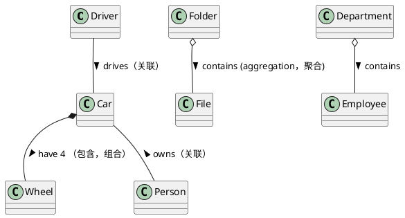

# plantuml

## 是什么

在产品分析和代码设计过程中需要用图形去表达和沟通，plantuml是一款用代码描述UML图形的工具。

## 图形

- [用例图](http://www.uml.org.cn/oobject/202012304.asp?artid=23534)
  - 用例图是用来描述系统所需功能的
  - 使用用例图根据用户的业务活动**梳理系统功能**，可以减少遗漏  
    
- 状态图
  - 说明某个事物**状态转换逻辑**，尤其是事物多状态的场景
  - 用于梳理复杂的状态逻辑
  - 要素
    - 节点是状态
    - 连线是动作


- 时序图
  - 描述**多个对象**之间的**交互，跟泳道图的区别在于更加常用语描述逻辑而不是操作流程**
  - 常用于描述前后端逻辑交互，需要多端配合交互的功能
  - 强调**交互**
- 活动图
  - 描述系统内某个用例或者流程的操作活动流程
  - 本质上是个流程图，描述活动的序列，即系统从一个活动到另外一个活动到控制流
  - 目的在于**表达“流程完整性”**而非活动细节，强调流程和逻辑判断
  - 要素
    - 节点是行为
    - 连线是下一步的逻辑判断
- 泳道图
  - **多角色、多系统**的活动图，更加清晰活动的所属角色
- 类图（ER 图）
  - 描述系统内物体概念的逻辑关系
  - **分析业务概念**
  - **分析代码架构**
  - 描述系统内代码模块的逻辑关系
    




## 确定产品核心功能流程

- 是什么

  - 产品对用户产生的价值的最简操作步骤

- 怎么做

  - 研究调研已有的产品常规流程

  - 如果是全新的义务功能流程（尤其是企业内部支撑系统）

  - 要求精通业务流程的义务方讲解一遍业务流程

  - 调研具体操作的人，验证是否有偏差

  - 实地观察和记录

  - 梳理结论

  - 明确业务流程范围、包含的功能模块、涉及的用户和角色

## uml 实践

业务设计阶段

1. 定义业务流程（有哪些流程和功能），定义系统范围（用例）
2. 梳理业务具体流程（活动图/泳道图）
3. 根据活动图梳理系统功能（用例图）
4. 定义系统规则（状态图）
5. 定义静态结构（类图）
6. 定义操作方法（序列图）

开发阶段

1. 架构图
2. 组件图
3. 类图

## 工具网站

1. [聚合在线 uml 图形编辑](https://niolesk.top/#https://kroki.io/plantuml/svg/eNpzKC5JLCopzc3hSs5JLC5WcClNzq7mUgACbYXgkqLMvHSFksySnFSFF_tnPpuxvqAov6AYLK0Lk05JLEmEyoKYz6ZueNa7DmpCcWlSbmaJhiZU_tm0nc82T4XJ5eSXFOulpKYlluaUaIC0aio865_wZN9sqNjL3TNerFvyrH_Ss-V73-_pQeZC1SGsq-VySM1LAXoDAK5eYQU=)
2. [时序图模板](https://www.edrawmax.cn/templates/5019/1/0)
3. [uml 在线画图工具](https://www.umletino.com/umletino.html)
4. [mermaid 在线网址](https://mermaid.live/edit#pako:eNptkstKw0AUhl9lGBBatT5AcSNWwYUrdxKQaTLqYDJTMhNEq6B4ofVCi1DxhiuxFaVaC6K26st0JnXlKziJMVYxm5z58_9fzhlOHprMwjANTRtxniFozkWOQfv6QHf9RJYLH-297tqlLtRaVb4WZPtZK53HfVm6lYVtWbw3KNDPCCUOssFwKgUynrkAQoLf2vxLaDf0UZY33zdqOu7v3vjXu78I_ZowTvh8BKiq4pvcavrNVpA7q_mFB03ttB46jzuqeCUbFdk4D8AHe-rwSTUrv9tZ0bRpnHXRlxzOGDaYB18KAANgSriEzoEsRgujzGYu6L4dq6PbnMty_NuV-nYJzEUGCRSZLF2qyp3ar__w-CJxEsnI0NtV-NFmgg9ZeBZ5tkgE8SRQpXLn9TTS3ltH3fqFKh2o6oueufcY-f78crV3tuDq8nHThArAyTKeoOMYi1g2ER1DIpH8Jx9eVgwYyDJmA8JnFoltxaLr0TgLB6GDXQcRS69QmDOgmMcONmBal9FMBjRoYEWeYFNL1ITpWWRzPAi9nJ4GR1sXq9gigrmT0V4Gr9VPZrwkRQ)
5. [Real World PlantUML](https://real-world-plantuml.com/?type=class)
6. [Excalidraw — Collaborative whiteboarding made easy](https://excalidraw.com/)

## 画图工具选择

主要有两种自动生成图形的画图工具

1. plantuml
   1. 优点：功能强大
   2. 缺点：使用麻烦，基于 java 开发
2. mermaid
   1. 优点：基于 js，大部分 mardown 软件内置支持渲染
   2. 缺点：常见图形可以实现，功能没有 plantuml 强大

个人推荐使用 plantuml，可以使用 markText 软件绘图查看，也可根据需求自行选择

- 简单的图形可以用 mermaid 或者 plantuml 实现
- 图形都可以用 mermaid 直接画，mermaid 支持良好，以 mermaid 举例，plantuml 同样的道理
- [mermaid 在线网址](https://mermaid.live/edit#pako:eNptkstKw0AUhl9lGBBatT5AcSNWwYUrdxKQaTLqYDJTMhNEq6B4ofVCi1DxhiuxFaVaC6K26st0JnXlKziJMVYxm5z58_9fzhlOHprMwjANTRtxniFozkWOQfv6QHf9RJYLH-297tqlLtRaVb4WZPtZK53HfVm6lYVtWbw3KNDPCCUOssFwKgUynrkAQoLf2vxLaDf0UZY33zdqOu7v3vjXu78I_ZowTvh8BKiq4pvcavrNVpA7q_mFB03ttB46jzuqeCUbFdk4D8AHe-rwSTUrv9tZ0bRpnHXRlxzOGDaYB18KAANgSriEzoEsRgujzGYu6L4dq6PbnMty_NuV-nYJzEUGCRSZLF2qyp3ar__w-CJxEsnI0NtV-NFmgg9ZeBZ5tkgE8SRQpXLn9TTS3ltH3fqFKh2o6oueufcY-f78crV3tuDq8nHThArAyTKeoOMYi1g2ER1DIpH8Jx9eVgwYyDJmA8JnFoltxaLr0TgLB6GDXQcRS69QmDOgmMcONmBal9FMBjRoYEWeYFNL1ITpWWRzPAi9nJ4GR1sXq9gigrmT0V4Gr9VPZrwkRQ)
- 点击打开观察以上网址https://mermaid.live/edit#是mermaid在线编辑网站，后面的是uml图形的编码
- 在可支持 mermaid 的 mardown 文件中使用可以直接用文字预览
- 如果是在非 markdown 文件中需要编写 mermaid 图形，可以使用 mermaid 在线 editor 服务的图形编码生成的图片编码，这样方便修改
- 复杂的图形
- 例如泳道图
- 涉及多角色，多平台的用 draw.io 或者[processon](https://www.processon.com/diagrams)画，
- 也可以用在线生成文件再导出到在线画图软件调整布局
- 架构图，包图，用[https://excalidraw.com/](https://excalidraw.com/)画

## vue 组件示例

```mermaid
class operation {
  + String desc
  + getValues()
  __ slots __
  default: 内容
}
note left: vue组件标准class类型
file id {
    component sumarry {
        class operation {
            __ props __
            __ methods __
            __ slots __
        }

        component disposeResult {

        }
    }
    component description{

    }
    component attackPathMap {

    }
}

```

## 参考

[产品必修课——轻松搞定 UML | 人人都是产品经理](https://www.woshipm.com/pmd/183238.html)

[UML 基础-火龙果软件工程](http://www.uml.org.cn/oobject/OObject.asp#9)

[基于 UML 的需求分析和系统设计](http://www.uml.org.cn/modeler/202108052.asp)
